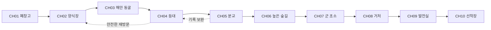

# 표류도 시즌 1 통합 개발 명세서

웹에서 먼저 실행하고 모바일 앱으로 확장하는 미스터리 방탈출 게임의 제작 기준이다. 검은방 3의 전반적인 분위기를 참고하며 그래픽은 현대적인 고해상도 2D로 제작한다. 세계관과 인물, 10챕터, 1챕터 25단계, 그래픽과 UI, React 및 TypeScript 기술 구조, AI 개발 요청, 검수 기준, 퍼즐 JSON을 포함한다. 작성 기준일은 2026년 10월 3일이다.

개발은 아래 AI 개발 작업 지시의 첫 개발 요청부터 진행한다. 사용자 최신 지시와 실제 원본 JSON이 우선이며 이 통합본은 원문에서 생성된 읽기용 사본이다. 수정은 개별 문서와 data/ch01.puzzles.json에 적용하고 node scripts/build-spec.mjs로 다시 생성한다. 현재 1챕터 P01~P25 웹 체험판과 정식 리소스·UI 이미지가 구현되어 있다. 최신 실행 상태는 07_UI_IMPLEMENTATION.md를 따른다.

## 원문 파일

- [01_GAME_DESIGN.md](01_GAME_DESIGN.md)
- [02_CHAPTER01_SPEC.md](02_CHAPTER01_SPEC.md)
- [03_ART_UI_GUIDE.md](03_ART_UI_GUIDE.md)
- [04_TECH_SPEC.md](04_TECH_SPEC.md)
- [05_AI_IMPLEMENTATION_TASKS.md](05_AI_IMPLEMENTATION_TASKS.md)
- [06_QA_CHECKLIST.md](06_QA_CHECKLIST.md)
- [07_UI_IMPLEMENTATION.md](07_UI_IMPLEMENTATION.md)
- [퍼즐 JSON](../data/ch01.puzzles.json)

## 표류도 게임과 이야기 설계

이 문서는 개발자가 게임의 목적과 사건의 진실을 먼저 이해하기 위한 기준이다. **폐시설이 남은 섬에서 물리적 탈출과 과거 사건의 재구성을 함께 수행하는 2D 미스터리 방탈출**을 만든다. 아래 설정·인물·정답·분기는 표류도용 창작 제안이며 제작 기본안으로 채택한다. 이 문서에는 결말 스포일러가 있다.

### 제품 방향

| 항목 | 기본안 |
| --- | --- |
| 가제 | 표류도 시즌 1 기억의 썰물 |
| 장르 | 탐색형 방탈출, 미스터리, 대화 어드벤처 |
| 플랫폼 | PC 및 모바일 웹 우선, Capacitor 모바일 앱 확장, 세로 화면 |
| 조작 | 터치 조사, 방향 버튼 이동, 아이템 선택 후 사용, 두 아이템 조합 |
| 참고 분위기 | 검은방 3의 폐쇄감, 인물 사이의 불신, 과거의 죄와 사건을 추적하는 긴장감 |
| 표현 | 고해상도 고정 시점 2D 배경, 현대적인 인물 반신 일러스트, 명확한 UI, 제한적인 환경 애니메이션 |
| 목표 플레이 시간 | 1챕터 35~50분, 시즌 1 약 5~7시간이라는 제작 목표 |
| 주요 경험 | 관찰로 단서 발견 → 이해로 잠금 해제 → 새 공간 → 증언과 물증의 모순 |
| 긴장 연출 | 감시 카메라, 방송, 파도, 조명과 정전, 제한 구간의 수위 |
| 첫 버전 범위 | 1챕터 완주, 조수 시스템 테스트용 별도 장면 |

시간과 분량은 실측 수치가 아닌 설계 목표다. 퍼즐 25개를 모든 챕터에 반복 배치하지 않는다. 1챕터의 25개는 **핵심 퍼즐 12개와 조사·획득·이동 13개**이며 실제 사고를 요구하는 퍼즐 수와 진행 단계 수를 구분한다.

시각 방향은 **검은방 3의 전반적인 분위기를 바탕으로 한 현대적인 2D 미스터리 스릴러**다. 표류도의 섬·시설·인물에 맞는 독자적인 디자인을 사용한다. 고해상도 제작, 입체적인 2D 명암, 정교한 재질과 조명, 가독성 높은 UI를 아트 완료 기준으로 삼는다. 탐색·아이템 사용·조합은 이 게임의 명세에 따라 구현하고, 참고작의 특정 루트나 UI 배치를 그대로 구현하는 것을 요구하지 않는다.

### 플레이 원칙

1. 필수 정답은 플레이어가 접근 가능한 단서에서 도출된다. 제작자가 아는 설정이나 검색 지식이 필요하지 않다.
2. 주변을 터치하면 조사 결과가 나오고, 재방문하면 현재 상태에 맞는 결과가 나온다. 같은 설명을 무한히 반복하지 않는다.
3. 틀린 사용은 짧은 이유를 알려 주며 아이템을 소모하지 않는다. 필수 아이템은 버리거나 영구적으로 잃을 수 없다.
4. 이야기를 읽거나 메뉴를 보는 동안 위험 타이머는 멈춘다. 화면 밖의 현실 시간으로 진행을 강제하지 않는다.
5. 단서의 위치를 찾는 어려움과 단서의 의미를 해석하는 어려움을 따로 조정한다. 점처럼 작은 터치 영역으로 난도를 높이지 않는다.
6. 주요 사실은 물증과 증언의 조합으로 확인한다. 마지막 방송 한 번으로 앞의 추리가 모두 무효가 되는 결말을 쓰지 않는다.

### 섬과 과거 사건

가상의 **연무도**는 남해 외곽의 작은 섬이다. 폐양식장, 분교, 등대, 군 초소, 중앙 발전실, 선착장이 있다. 주요 경로는 낮은 해안길과 높은 숲길 두 축으로 연결된다. 납치범은 오래된 유선 스피커와 CCTV 일부를 복구했지만, 섬 전체를 실시간으로 통제하는 초능력 같은 감시 능력은 없다.

사건은 현재로부터 8년 전 9월 17일에 발생했다. 양식장 운영사 **해담개발**이 불법 폐수 배출을 숨기기 위해 관측 기록과 안전 보고서를 조작했다. 태풍 접근 시 저지대 대피 방송까지 지연되어 주민 6명이 사망했다. 공식 발표는 주민의 무단 진입과 자연재해를 원인으로 기록했다.

주인공 한도윤은 당시 외주 조사 업체의 신입 기록 담당자였다. 원본 수위 기록과 대피 방송 로그를 발견했지만 상사의 압박 아래 축약된 안전 보고서에 전자서명했다. 그날 밤 뒤늦게 원본을 저장 장치에 복사하고 주민 대피를 도우려 했다. 도움이 있었다는 사실은 책임을 지워 주지 않는다. 피해자 유가족은 보고서 서명과 지연된 방송만 알고 있다.

현재의 감금은 사고가 아닌 계획된 범죄다. 납치범 윤태오는 죽은 누나의 명예를 회복할 증거와 책임 인정이 필요해 사건 관계자를 섬으로 데려왔다. 도윤은 납치 과정에서 넘어져 머리를 다쳐 섬과 직전 상황의 기억이 단편화됐다. 평소 지식과 아이템 사용 능력은 유지된다. 작품 안에서는 진단명을 확정하지 않고 기억 공백의 상태만 보여 준다.

### 사건 시간표

| 시점 | 실제 사건 | 플레이어가 먼저 받는 정보 |
| --- | --- | --- |
| 8년 전 9월 15일 | 원본 관측에서 위험 수위와 폐수 흔적 확인 | CH02 관리 일지의 삭제 흔적 |
| 9월 16일 | 해담개발이 보고서 수정 요구, 도윤이 축약본에 서명 | CH05 사진 속 주인공 얼굴 |
| 9월 17일 18시 40분 | 대피 방송 요청이 접수됨 | CH04 등대의 중계 기록 |
| 19시 10분 | 운영사 지시로 방송 보류 | CH07 무전 로그와 서명 불일치 |
| 19시 35분 | 해안길 침수, 주민 고립 | CH03 벽의 대피 표식 |
| 20시 05분 | 도윤이 수동 방송과 구조에 가담 | CH08 원본 CCTV의 두 번째 구간 |
| 현재 D일 16시 30분 | 도윤이 창고에서 각성 | CH01 방송과 감금 상태 |
| D일 밤 | 폭풍 접근, 태오의 시설 통제 붕괴 | CH09 감시의 한계와 협력 가능성 |
| D+1일 새벽 | 출항 가능 조수 창 | CH10 조수표와 마지막 선택 |

게임 시간은 사건 연출용 수치이며 실제 천문 계산을 재현하지 않는다. 챕터가 넘어갈 때 필요하면 이야기 시간 점프를 표시한다. 5시간 플레이가 섬의 5시간과 동일하다고 약속하지 않는다.

### 인물

| 인물 | 표면 역할 | 사실과 개인 목표 | 말투 및 시각 특징 |
| --- | --- | --- | --- |
| 한도윤 31세 | 기억이 끊긴 기록 담당자, 플레이어 | 서명에 책임이 있다. 원본을 공개하고 생존자를 탈출시키려 한다 | 짧은 관찰문, 마른 회색 셔츠와 사용 흔적, 오른손 오래된 흉터 |
| 윤태오 34세 | 방송 속 감시자 | 연무도 출신 설비 기사. 누나 윤서희의 사망과 주민 누명에 분노 | 낮고 절제된 문장, 작업 점퍼, 후반에 피로와 흔들림 |
| 박서린 29세 | CH06에서 만나는 생존자 | 당시 분교 자원봉사자. 현재 기록을 추적한 지역 기자 | 확인 질문이 많음, 방수 재킷, 메모 수첩 |
| 강민석 46세 | 다른 감금 피해자, CH02 흔적과 CH07 대면 | 당시 운영사 관리 책임자. 방송 보류를 집행했다 | 책임을 분산하는 말투, 구겨진 와이셔츠 |
| 오혜진 39세 | CH05에서 구조하는 피해자 | 당시 보고서 검토자. 수정 지시 메일을 보관했다 | 정확한 수치와 날짜, 안경, 손목 붕대 |
| 윤서희 사건 당시 25세 | 기록과 기억 속 인물 | 태오의 누나, 분교 보조교사. 대피를 돕다가 사망 | 현재 인물과 혼동하지 않는 기록 프레임, 독자적 디자인 |

도윤의 내면 관찰은 진실과 다른 확신을 사실 문장으로 쓰지 않는다. 기억 조각은 날짜가 흐릿한 표현으로 제시하며 기록으로 검증하기 전에는 수첩에서 ‘미확인’으로 분류한다. 서린은 정답을 자동 제공하는 동료가 아니라 도윤의 해석을 반박하는 인물이다.

### 10챕터 진행 설계

| 장 | 공간과 목표 | 대표 퍼즐과 실제 해법 | 이야기 보상 | 다음 장 조건 |
| --- | --- | --- | --- | --- |
| CH01 각성 | 폐창고 4공간에서 나가기 | 선반 417, 점검함 123, 배수 밸브, UV 출구 2641 | 서명 흔적, 스피커의 기억 요구 | 외부 게이트 통과 |
| CH02 수면 아래 | 관리동과 수조 3구역, 해안길 열기 | 펌프를 정지한 뒤 우회 밸브로 목표 수위 표식 2까지 낮춤. 측정컵 대신 눈금과 배관도가 단서 | 강민석 이름이 적힌 훼손 일지 E01 | 배수 완료와 관측 시계 획득 |
| CH03 바다가 닫히기 전에 | 동굴 3장면, 중계 열쇠 회수 | 조수표의 썰물 구간에 입장. 반사판 3개를 동굴 표식에 따라 회전해 표적을 밝힘 | 주민 대피 동선과 당시 생존 시간의 모순 | 중계 열쇠 회수 후 안전구역 도착 |
| CH04 꺼진 등대 | 등대 4구역, 지도 및 기록 확보 | 단말에 표시된 모스 대응표로 3자 메시지를 해독. 렌즈는 육상 표적 기호와 정렬 | 대피 요청 접수 시각 E02, 전체 섬 지도 | 중계 장치 복구와 지도 확보 |
| CH05 마지막 출석 | 분교 4구역, 혜진 구조 | 결석 표시·학급 사진·자리표를 대조해 잠긴 교무실의 사물함 순서를 도출 | 도윤의 방문 사진, 보고서 서명 기억, 혜진 증언 | 혜진 구조와 높은 숲길 열쇠 |
| CH06 숲의 목격자 | 숲길 3구역, 서린과 합류 | 장력 표시를 읽고 안전 고정핀부터 끼운 다음 줄을 풀어 덫 해제. 판자와 끈으로 짧은 다리 보강 | 원본과 수정본이 모두 필요하다는 목표 | 동료 합류와 초소 진입 |
| CH07 응답 없는 주파수 | 초소 3구역, 로그 복구 | 현장 주파수표로 수신 대역 선택, 난수표의 날짜 행과 호출부호 열 교차. 외부 안테나 단선 때문에 구조 요청은 실패 | 방송 보류 서명 E03, 통신선이 거처로 이어짐 | 통신 로그 백업과 감시선 추적 |
| CH08 감시자의 방 | 거처 4구역, 동기와 원본 확보 | 모니터 시각 오차를 로그로 보정하고 두 CCTV 구간을 맞춤. 날짜 파일에 접근 | 태오의 신원, 도윤의 서명 책임과 뒤늦은 구조 행동, 원본 영상 E04 | 원본 백업, `acknowledged_responsibility` 선택 |
| CH09 폭풍의 밤 | 발전실과 피난실 3구역, 동료 구조 | 차단 순서·연료 공급·시동 순서를 작업 지침으로 확인. 추격은 소리 경고에 맞춰 지정 은신처 선택 | 태오의 통제 실패, 협력 또는 강행 | 발전기 복구, 혜진과 서린의 생존 확정 |
| CH10 새벽의 선착장 | 부두와 보트 3구역, 출항 | 정비 설명서로 연료선·접점 수리, 등대 신호와 조수표의 안전 출항 창 일치 | 책임 인정과 증거 공개의 선택, 3개 엔딩 | 수리 완료 후 출항 또는 대면 실패 |

CH02 이후의 세부 숫자·장면별 핫스폿·전체 대사·데이터는 각 장 개발 전에 작성해야 한다. 이 표의 대표 해법을 근거 없는 임의 비밀번호로 대체하지 않는다. CH03 시계는 CH02에서 이미 설명하고 CH01에는 미리보기 안내만 둔다.

### 섬 이동과 지도



실제 지도는 공간 위치를 보여 주고 스토리 선형도와 구분한다. 초반에는 발견한 구역만 표시하며 CH04에서 전체 지형을 공개한다. 잠긴 구역은 잠금 사유를 표시한다. 빠른 이동은 발견·안전·현재 조수 통행 가능 조건을 모두 만족할 때만 제공한다. CH01의 지도 버튼은 사용 가능하며 ‘섬 위치 미확인’과 현재 창고 내부도만 보여 준다.

### 조수와 위험

기본 조수는 **확정 행동 기반**이다. 일반 조사·대화·메뉴·실패한 입력은 시간을 진행시키지 않는다. 이동 또는 명시적인 ‘기다리기’만 1틱씩 진행한다. 주기는 LOW 4틱 → RISING 2틱 → HIGH 4틱 → FALLING 2틱이다. 1틱은 이야기상의 5분으로 표시하지만 실제 해양 조석 주기라고 설명하지 않는다.

CH03에서는 동굴에 들어가기 전에 별도의 **실시간 수위 구간**을 고지한다. 기본 180초, 여유 모드 360초, 접근성 모드는 위험 타이머 없음이다. 입장 시 LOW와 잔여 위험 틱 4 이상이 필요하며, 위험 구간에서는 일반 조수 틱을 동결하고 수위 타이머가 퇴로를 제어한다. 경고는 남은 90·45·15초에 소리·텍스트·수위 표시로 중복 제공한다. 만료 시 안전 입구로 자동 후퇴하고 입장 체크포인트로 복원한다. 아이템과 퍼즐은 입장 전 상태로 롤백한다. 읽기·메뉴·백그라운드에서 타이머는 정지한다.

현재 수위가 바뀌어도 캐릭터가 갇히는 장면은 만들지 않는다. 모든 조수 제한 공간에는 안전한 퇴로 또는 자동 후퇴가 있다. 강제 실패는 배드 엔딩이 아니라 재시도 경험이다. CH09의 추격도 같은 원칙을 적용하되 별도의 지역 체크포인트를 쓴다.

### 방송과 힌트

스토리 방송은 도착 이벤트당 한 번만 실행하고 수첩에 전문을 보관한다. 힌트 방송은 플레이어가 현재 과제를 선택한 뒤 요청한다. 1단계는 위치, 2단계는 해석, 3단계는 정확한 조작 또는 정답이다. 광고나 재화 소비는 첫 버전에 없다. 힌트 사용은 엔딩 조건을 바꾸지 않는다.

태오는 CH01에서 ‘기억해 내면 보내 줄게’라고 말한다. CH08에서 기억만으로 증거가 생기지 않는다는 사실이 드러나고, 플레이어는 원본 확보를 선택한다. 방송이 항상 진실을 말하는 것은 아니므로 방송 자체를 정답 단서로 쓸 때는 현장 표식이나 기록으로 검증할 수 있어야 한다.

### 증거와 엔딩

| 증거 ID | 내용 | 획득 조건 |
| --- | --- | --- |
| E01 | CH02 훼손 관리 일지 | 관리동 서랍 조사, 엔딩용 보완 가능 |
| E02 | CH04 대피 요청 접수 원본 | 등대 중계 복구, 엔딩용 보완 가능 |
| E03 | CH07 방송 보류 서명 로그 | 진행상 필수 |
| E04 | CH08 원본 CCTV 백업 | 진행상 필수 |

엔딩 평가는 CH10 최종 선택 직전에 한 번 실행한다. 우선순위는 B → T → N이다. `all_rescued`는 CH09 종료 시 서린과 혜진 두 인물이 모두 안전할 때 참이다.

| 엔딩 | 결정 조건 | 결과 |
| --- | --- | --- |
| B 침묵의 섬 | 최종 대면에서 `violence` 선택 | 시설 손상으로 출항 창을 놓친다. 직전 체크포인트에서 다시 선택 가능 |
| T 기억의 귀환 | `nonviolent` 선택 AND E01~E04 전부 확보 AND 책임 인정 AND 두 동료 구조 | 모두 탈출하고 원본 공개. 도윤도 조사에 응하며 책임을 인정한다 |
| N 표류 끝 | B가 아니고 T 조건을 모두 충족하지 못함 | 생존자는 탈출하나 사건의 일부가 증명되지 않는다 |

E01·E02는 CH09 진입 전 안전 재방문으로 보완 가능하다. 분기 직전에 ‘미확보 기록 2건’처럼 현재 상태를 알려 주며, 최종 선택의 구체적 결말은 노출하지 않는다. E03·E04는 필수 진행 증거이므로 놓친 채 최종 장에 진입하지 않는다. 첫 회차에도 T 엔딩을 볼 수 있다. 엔딩 갤러리에는 본 엔딩만 표시한다.

### 제작 범위와 분량

10챕터 배경 장면은 위 표 기준 34개를 초기 예산으로 잡는다. 근접 화면·상태 변화·회상 CG는 별도다. 1챕터는 P01~P10 웹 데모 → 전체 25단계 → 실제 아트 적용 → Android 앱 검증 순으로 만든다. 1챕터를 검증한 뒤 나머지 챕터를 같은 데이터 구조로 확장한다.

가격·등급·출시 일정은 확정하지 않았다. 폭력 표현은 결과와 긴장 중심으로 계획하며 유혈 클로즈업은 첫 아트 범위에 넣지 않는다. 제작 중 핵심 조작과 모바일 가독성이 검증되면 목표 시간과 분량을 재산정한다.

## 표류도 1챕터 구현 명세

1챕터 제목은 **각성**이다. 창고에 묶인 한도윤이 결박을 풀고, 관리실에 진입하고, 설비를 복구한 뒤 외부 적재장으로 나간다. **이 문서와 `data/ch01.puzzles.json`만으로 P01~P25를 구현할 수 있어야 한다.** 정답은 제작용 정보이며 플레이 화면에 미리 표시하지 않는다.

### 시작과 종료 상태

시작 시 `chapterId=CH01`, `sceneId=R01`, `viewId=A`, 인벤토리·증거·완료 ID는 비어 있다. 입력은 열려 있으며 의자 주변 조사만 가능하다. 지도에는 창고 내부의 현재 위치만 표시한다. 챕터 제목과 첫 대화가 끝나면 P01에 접근한다. 조수와 위험 타이머는 비활성이다.

종료 조건은 **P25 완료**다. P24는 잠금 해제일 뿐 챕터 완료가 아니다. P25에서 `chapter_complete=true`를 설정하고 엔딩 같은 임시 CH02 안내 화면으로 전환한다. CH02 미구현 시 더 진행할 수 있다는 가짜 버튼을 만들지 않고 ‘1챕터 완료’와 재시작·타이틀 버튼을 보여 준다.

### 공간과 시점

| 공간 | 뷰와 구성 | 입장 조건 | 연결 |
| --- | --- | --- | --- |
| R01 감금 창고 | A 의자, B 선반과 잠금함, C 배전함, D 환기구와 관리실 문 | 최초 입장 | P03 이후 A↔B↔C↔D 자유 전환, P10 이후 R02 |
| R02 관리실 | A 책상·기록, B 달력·점검함, C 설비실 문 | P10 | R01, P17 이후 R03 |
| R03 설비실 | A 작업대, B 밸브·집수정, C 적재장 통로 | P17 | R02, P21 이후 R04 |
| R04 적재장 | A 출구 키패드·바깥 문 | P21 | R03, P25 이후 CH02 안내 |

총 4개 공간, 11개 기본 시점이다. 전체 기획의 ‘배경 34장’은 공간별 대표 배경 수이며 이 시점 수와 다르다. 실제 자산 예산에서는 같은 공간의 추가 시점도 별도 배경으로 센다. 최초 데모는 R01의 A·B·D와 R02 A만 구현해도 된다.

R01은 P03 이전에는 방향 버튼이 잠겨 있다. 숨겨진 공간을 키보드로 우회할 수 없도록 이동 조건을 도메인 로직에서도 검사한다. R04로 이어지는 낮은 통로는 집수정이 가득 차 있을 때 통행 불가이며 P21 이후 안전하게 열린다.

### 핫스폿 좌표 기준

장면 이미지의 좌상단은 `(0,0)`, 우하단은 `(1,1)`이다. `x,y,w,h`는 이미지 콘텐츠 영역 기준이다. 다음 좌표는 **블록아웃용 기본값**이며 최종 아트 적용 시 같은 물체의 위치에 맞게 수정한다. 좌표 변경은 정답과 접근 조건을 바꾸지 않는다.

| 뷰 | 주요 핫스폿과 사각형 |
| --- | --- |
| R01 A | 결박 `(0.30,0.45,0.38,0.18)`, 의자 버팀대 `(0.20,0.68,0.30,0.22)`, 스피커 `(0.74,0.08,0.18,0.14)` |
| R01 B | 선반 `(0.12,0.16,0.38,0.54)`, 쪽지 `(0.18,0.61,0.18,0.12)`, 잠금함 `(0.59,0.44,0.26,0.28)` |
| R01 C | 배전함 `(0.25,0.22,0.48,0.58)`, 주차단기 `(0.60,0.35,0.15,0.23)` |
| R01 D | 환기구 `(0.13,0.42,0.28,0.26)`, 문 `(0.58,0.18,0.28,0.63)` |
| R02 A | 찢긴 도면 조각 `(0.28,0.51,0.34,0.17)`, 서랍 `(0.26,0.70,0.36,0.17)` |
| R02 B | 달력 `(0.16,0.16,0.24,0.30)`, 점검함 `(0.57,0.49,0.28,0.30)` |
| R02 C | 설비실 문 `(0.29,0.16,0.42,0.66)` |
| R03 A | 배터리 `(0.38,0.54,0.23,0.17)` |
| R03 B | 밸브 `(0.18,0.25,0.60,0.27)`, 집수정 `(0.25,0.67,0.48,0.24)` |
| R03 C | 낮은 통로 `(0.28,0.34,0.43,0.52)` |
| R04 A | 키패드 `(0.68,0.36,0.16,0.22)`, 게이트 `(0.21,0.14,0.40,0.68)` |

목표가 44 CSS px보다 작아지면 주변의 빈 영역까지 투명 버튼을 확장한다. 두 버튼이 겹치면 작은 대상은 근접 화면으로 이동한다. 하단 대화창·아이템 바·이동 버튼에는 장면 터치가 전달되지 않는다.

### 25개 진행 단계

선행 조건은 완료 ID를 뜻한다. 같은 번호 순서로 강제 진행하지 않는다. 예를 들어 P04를 나중에 조사하거나 P13을 관리실 진입 전에 해결해도 성립한다. **핵심 12개**는 P03·P05·P07·P08·P09·P11·P14·P16·P19·P21·P23·P24다. 나머지 13개는 조사·획득·이동 단계다.

| ID | 구분과 위치 | 단서와 정확한 성공 입력 | 선행 조건 | 결과 |
| --- | --- | --- | --- | --- |
| P01 | 조사 R01 A | 결박 조사. 매듭 뒤로 손끝이 조금 움직이고 의자 왼쪽 버팀대가 썩어 있음을 확인 | 없음 | 의자 상호작용 열림 |
| P02 | 조작 R01 A | ‘왼쪽으로 체중 싣기’를 3회. 매회 균열이 커짐, 순서 암기 없음 | P01 | 금속 조각 획득 |
| P03 | 핵심 R01 A | 금속 조각 선택 → 손목 결박 사용 | P02 | 금속 조각 소모, 끈 획득, 뷰 이동 열림 |
| P04 | 조사 R01 B | 선반 쪽지 획득. 전문 ‘높은 칸부터 낮은 칸까지. 앞에 적힌 숫자만.’ | P03 | 쪽지 A 획득 |
| P05 | 핵심 R01 B | 선반 앞면 큰 숫자가 위 4·중간 1·아래 7. 쪽지 순서로 잠금함에 `417` | P04 | 잠금함 개방 |
| P06 | 획득 R01 B | 열린 잠금함 내부 조사 | P05 | 드라이버와 자석 동시 획득 |
| P07 | 핵심 R01 D | 드라이버 → 나사 4개가 보이는 환기구 덮개. 나사별 클릭 반복은 없음 | P06 | 환기구 개방, 아래 금속 열쇠가 보임 |
| P08 | 핵심 인벤토리 | 끈과 자석을 조합. A+B와 B+A 모두 허용 | P03, P06 | 끈·자석 소모, 자석 줄 획득 |
| P09 | 핵심 R01 D | 자석 줄 → 열린 환기구. 짧은 인양 애니메이션, 정밀 드래그 없음 | P07, P08 | 관리실 열쇠 획득, 자석 줄 유지 |
| P10 | 이동 R01 D | 관리실 열쇠 → 문 | P09 | 열쇠 유지, R02 개방과 첫 진입 |
| P11 | 핵심 R02 A | 쪽지 A → 책상의 도면 하단 조각. 상단 A와 하단 조각의 파선·화살표가 연결되게 배치 | P04, P10 | 쪽지 A 소모, 회로도 증거 획득 |
| P12 | 획득 R02 A | 책상 서랍 조사 | P10 | 예비 퓨즈 획득 |
| P13 | 조작 R01 C | 드라이버 → 배전함 커버. 주차단기는 처음부터 OFF, F1·F2가 보임 | P06 | 배전함 개방 |
| P14 | 핵심 R01 C | 회로도 ‘조명과 문 잠금 회로 F2’를 확인한 뒤 퓨즈 → `F2` | P11, P12, P13 | 퓨즈 소모, F2 복구 |
| P15 | 조작 R01 C | 복구된 배전함의 주차단기를 `ON` | P14 | 관리실 조명과 설비실 전기 잠금 전원 활성 |
| P16 | 핵심 R02 B | 밝아진 달력 ‘점검일 12일’, 근무표 ‘3조’, 점검함 ‘날짜 2자리 + 조 1자리’ → `123` | P10, P15 | 밸브 손잡이·전지 없는 UV 램프 획득 |
| P17 | 이동 R02 C | 전원이 켜진 설비실 문 열기 | P10, P15 | R03 개방과 진입 |
| P18 | 획득 R03 A | 작업대 배터리 팩 조사 | P17 | AA 2개 묶음 배터리 팩 획득 |
| P19 | 핵심 인벤토리 | UV 램프 + 배터리 팩 조합 | P16, P18 | 두 재료 소모, 작동 UV 램프 획득 |
| P20 | 조사 R03 B | 밸브 작업 표찰 조사. ‘바다 유입 닫기 / 저수 연결 닫기 / 배출 열기 / 마지막에 구동’ | P17 | 배수 절차 증거 획득 |
| P21 | 핵심 R03 B | 손잡이 사용 후 `sea=closed,tank=closed,outlet=open`, ‘구동’ 선택 | P16, P20 | 손잡이 설치·소모, 배수 완료, R04 통로 개방 |
| P22 | 획득 R03 B | 빈 집수정 바닥 조사 | P21 | 황동 명판 획득 |
| P23 | 핵심 명판 근접 | 작동 UV 램프 → 명판. 숫자 2·6·4·1이 각각 파도·등대·배·별 옆에 나타남 | P19, P22 | 출구 암호 증거 획득 |
| P24 | 핵심 R04 A | 명판의 새김 순서 ‘파도 → 등대 → 배 → 별’로 `2641` 입력 | P21, P23 | 외부 게이트 잠금 해제 |
| P25 | 이동 R04 A | 열린 게이트 조사 후 ‘밖으로 나간다’ | P24 | CH01 완료, 다음 장 안내 |

### 핵심 퍼즐의 UI와 실패 처리

| 종류 | UI | 실패 반응 | 재시도와 상태 |
| --- | --- | --- | --- |
| 숫자 P05·P16·P24 | 게임 내 숫자 키패드, 입력 칸, 지우기, 확인, 닫기. 시스템 키보드는 사용하지 않음 | ‘잠금이 풀리지 않는다.’와 짧은 금속음 | 입력만 초기화, 횟수 제한·아이템 손실 없음 |
| 도구 P03·P07·P09 | 선택된 아이템명과 대상 이름을 함께 표시 | 대상별 한 문장, 예 ‘이 나사는 손으로 풀 수 없다.’ | 선택 아이템 유지, 원하지 않으면 취소 |
| 조합 P08·P19 | 첫 아이템 선택 → ‘조합’ → 두 번째 선택 → 조합 확인 | ‘이 둘을 연결할 방법이 없다.’ | 재료 유지, 조합 모드 종료 |
| 도면 P11 | 2조각 근접 패널, 탭으로 위치 선택, 뒤집기 없음 | ‘배선과 파선이 이어지지 않는다.’ | 배치를 수정 가능, 중간 배치는 임시 UI 상태 |
| 퓨즈 P14 | F1·F2 중 선택. 회로도 바로 열기 버튼 | F1은 ‘여긴 통신 예비 회로다. 조명 회로를 찾아야 한다.’ | 퓨즈 유지, 전원은 여전히 OFF |
| 배수 P21 | 3개 밸브 각각 열림·닫힘 토글 + 구동 버튼 | ‘배관이 떨린다. 연결 표찰을 다시 확인하자.’ | 물 변화 없음, 손잡이 설치는 성공 트랜잭션 때 확정 |
| UV P23 | 명판 전체 확대, UV 사용 버튼으로 숫자 레이어 노출 | 다른 조명은 ‘새김 뒤에 다른 표식이 있는 듯하다.’ | UV·명판 모두 유지, 발견 후 증거에서 다시 보기 |

P21의 손잡이를 시험 설치하는 애니메이션은 임시 표현이다. 잘못된 밸브 상태에서 구동했을 때 아이템을 먼저 지워서는 안 된다. 성공 입력에만 `consumeItems`를 적용한다. 밸브는 처음 sea=open, tank=open, outlet=closed다. 회전 수나 실제 물리 유량 계산은 사용하지 않는다.

P23은 UV로 이미 완성된 그림을 보여 주는 것만으로 완료된다. 숫자 해석은 P24가 담당한다. 확대 패널을 닫아도 증거는 남으며 램프 배터리 사용량 시스템은 없다.

### 단서 원문

- P04 쪽지 A에는 ‘높은 칸부터 낮은 칸까지. 앞에 적힌 숫자만.’이라는 문장과 회로도 상단이 같이 인쇄되어 있다. 위·중간·아래 숫자는 각각 4·1·7이며 쪽지에 정답 417을 직접 적지 않는다.
- P11 완성 회로도에는 ‘주차단기 OFF 확인 → F2 예비 퓨즈 → 커버 정리 → 주차단기 ON’과 F1 통신 예비 / F2 관리실 조명·문 잠금이라는 두 레이블이 있다.
- P16 달력은 12일에 ‘기계 점검’, 같은 날짜 근무표에는 ‘3조’라고 적는다. 점검함에는 ‘점검일 DD + 근무조 N’을 숫자 입력 규칙으로 명시한다. 달·연도는 필요하지 않다.
- P20 작업 표찰은 문자와 배관 아이콘을 동시에 쓴다. 색상만으로 바다·저수·배출을 구분하지 않는다.
- P22 명판에는 ‘빛 아래에서 표식을 잇는다’와 ‘파도 → 등대 → 배 → 별’이 눈으로 보인다. P23 UV에서 각 기호 옆에 2·6·4·1이 나타난다. 화면상 배치 순서가 정답을 우연히 보여 주지 않게 기호 배치는 서로 섞는다.

정답에 필요한 문자·숫자는 배경 이미지의 AI 생성 글자로 처리하지 않는다. 텍스트·기호를 별도 UI 또는 정밀 제작된 레이어로 얹어 변형과 오독을 막는다.

### 아이템과 증거

| ID | 이름 | 획득 | 소모와 유지 |
| --- | --- | --- | --- |
| metal_shard | 금속 조각 | P02 | P03에서 소모 |
| rope | 끈 | P03 | P08 조합 재료 |
| note_a | 쪽지 A | P04 | P11에서 소모, 전문은 수첩 기록 유지 |
| screwdriver | 드라이버 | P06 | P07·P13에서 재사용 |
| magnet | 자석 | P06 | P08 조합 재료 |
| rope_magnet | 자석 줄 | P08 | P09에서 유지 |
| office_key | 관리실 열쇠 | P09 | P10 이후 유지 |
| fuse | 예비 퓨즈 | P12 | P14에서 소모 |
| valve_handle | 밸브 손잡이 | P16 | P21 성공 때 소모·설치 |
| uv_lamp | 전지 없는 UV 램프 | P16 | P19 조합 재료 |
| battery_pack | 배터리 팩 | P18 | P19 조합 재료 |
| uv_lamp_ready | 작동 UV 램프 | P19 | P23 이후 유지 |
| exit_plate | 황동 명판 | P22 | P23 이후 유지 |

증거 ID는 `circuit_plan`·`drain_procedure`·`exit_cipher`다. 이들은 인벤토리 아이템 수에 포함하지 않는다. P04 단서와 방송·달력 관찰은 로그에 저장한다. 엔딩 핵심 증거 E01~E04와 CH01 증거는 별도이며, CH01의 선택이나 힌트는 엔딩을 잠그지 않는다.

인벤토리 최대 수량 제한은 없다. 선택은 1개, 조합은 2개까지만 허용한다. 재료 두 개 중 하나가 없으면 조합 성공을 적용할 수 없다. P06·P16은 두 아이템을 한 번에 주며 다시 조사해도 복제되지 않는다.

### 목표 문구와 대사

현재 목표는 가장 최근 성공한 번호가 아니라 핵심 상태로 계산한다. 우선순위는 P24 완료 ‘밖으로 나간다’ → P21 완료 ‘적재장 게이트를 연다’ → P15 완료 ‘설비실을 조사한다’ → P10 완료 ‘창고 설비의 전원을 복구한다’ → P03 완료 ‘관리실 문을 연다’ → ‘결박에서 벗어난다’다. 필요한 선행 과제가 여러 개면 힌트 목록에서 각각 선택할 수 있다.

| 이벤트 ID | 발동 | 대사 |
| --- | --- | --- |
| D01_001 | 새 게임 처음 | 도윤 ‘손목이… 묶여 있다. 여긴 어디지?’ |
| D01_002 | 첫 방송 | 스피커 ‘기억해 내면 보내 줄게.’ |
| D01_003 | 같은 방송 후 | 도윤 ‘누구야? 내가 뭘 기억해야 한다는 거야?’ |
| D01_004 | P03 | 도윤 ‘풀렸다. 이 끈은 챙겨 두자.’ |
| D01_005 | P10 | 도윤 ‘관리실이다. 여기라면 밖으로 나갈 방법이 있을지도.’ |
| D01_006 | P11 | 도윤 ‘이 서명… 본 적이 있다. 그런데 이름이 떠오르지 않는다.’ |
| D01_007 | P15 | 스피커 ‘불을 켜는 법은 기억하는군.’ |
| D01_008 | P23 | 도윤 ‘맨눈으로는 안 보였던 숫자다. 순서는 명판에 있다.’ |
| D01_009 | P25 | 도윤 ‘파도 소리… 건물 바깥은 섬이었어.’ |
| D01_010 | P25 후 | 스피커 ‘네가 떠난 곳을 기억하나?’ |

P11 회로도의 서명은 실제 과거 보고서 서명과 동일한 필체처럼 보이는 창고 유지보수 기록의 복사 흔적이다. CH01에서는 사람 이름을 선명하게 공개하지 않는다. 후반 사실을 수첩 제목이나 이미지 파일 대체 텍스트로 미리 노출하지 않는다.

대사는 이벤트당 한 번만 자동 재생한다. 수첩에서 수동 재열람할 수 있다. 자동 재생 중 닫기나 앱 전환이 발생하면 아직 읽지 않은 줄부터 복원한다. 완료된 퍼즐의 보상을 대사 종료 때 지급하면 재실행에서 복제될 수 있으므로, 보상은 퍼즐 성공 시 먼저 확정하고 대사는 후속 이벤트로 큐에 넣는다.

### 힌트와 예시 완주 경로

25단계 각각의 3단계 힌트는 JSON에 있다. 1단계만 열 때 2·3단계를 자동 노출하지 않는다. 성공한 퍼즐은 힌트 대상에서 제외한다. 선행 조건이 충족되지 않은 퍼즐 대신 지금 실행 가능한 선행 과제를 보여 준다.

기준 완주는 P01→P02→P03→P04→P05→P06→P07→P08→P09→P10→P11→P12→P13→P14→P15→P16→P17→P18→P19→P20→P21→P22→P23→P24→P25다. 유효한 다른 경로로는 P13을 P07보다 먼저, P08을 P07보다 먼저, P17·P18·P20을 P16보다 먼저 수행할 수 있다.

R02에서 R01로 돌아오는 길은 계속 열린다. P16 이전 R03에 먼저 들어가도 밸브 손잡이를 얻기 위해 되돌아올 수 있다. P21 이후에도 P19를 완료하지 않았다면 R02·R03 작업대로 복귀할 수 있다. 특정 문을 통과했다는 이유로 필수 재료가 사라지지 않는다.

### 완료 기준

새 게임에서 공략 없이 필요한 단서를 모두 볼 수 있고, 정확한 입력으로 P25에 도달해야 한다. P03·P10·P15·P21·P24 직후 저장 및 새로고침을 각각 검증한다. 잘못된 코드·잘못된 조합·중복 탭은 아이템을 지우거나 복제하지 않는다. 데모에서는 정식 아트 대신 물체 이름이 붙은 자리표시자를 허용하되, 제작용 정답은 화면에 노출하지 않는다.

## 표류도 그래픽과 UI 구성 가이드

목표는 **검은방 3의 폐쇄감과 인물 사이의 긴장을 참고한 현대적인 고해상도 2D 미스터리 스릴러**다. 참고 범위는 전반적인 분위기이며 배경·인물·UI는 표류도에 맞게 새로 제작한다. 배경은 고정 시점으로 읽히고, 인물은 대화 때 반신 일러스트로 나타나며, 주요 행동은 하단에서 실행한다. 다음 해상도·색·배치 수치는 표류도용 제안 사양이다.

2026-10-03 사용자 승인: [창고 컨셉](../art/concepts/ch01_warehouse_mood_v01.png)의 밝기와 사용 흔적을 제작 기준으로 확정했다. **적당히 낡았지만 건전한 구조, 마른 바닥, 부드러운 낮빛, 읽기 쉬운 그림자**를 우선한다. 습기·곰팡이·물웅덩이·심한 부식으로 분위기를 만들지 않는다. 물은 수조·집수정·바다 등 퍼즐에 필요한 위치에만 표현한다. 밤과 폭풍도 주요 물체가 보이게 조명한다. 생성 원본의 실제 크기는 `art/production/v01/manifest.json`에 기록하며 아래 제안 크기로 생성됐다고 간주하지 않는다.

### 검은방 3에서 참고할 분위기

검은방 3 총괄기획자의 인터뷰는 인물 군상과 죄의식, 추리 난도와 이야기 몰입의 균형을 설명한다. 이것을 표류도의 감정과 이야기 톤을 정하는 참고점으로 사용한다. [ZDNet의 검은방 3 기획자 인터뷰](https://zdnet.co.kr/view/?no=20100604124901).

검은방 3의 공개 화면에서 폐시설 배경, 배경 앞의 인물 일러스트, 대화와 선택지가 함께 표현되는 모습을 확인했다. [GG게임의 검은방 3 소개와 공개 화면](https://www.ggemguide.com/mobile_view.htm?dpage=10&gkey=ac&search=&uid=2206). 이 화면은 분위기 해석에 사용하며 표류도의 해상도·그림체·아이콘·버튼 배치를 결정하는 템플릿으로 사용하지 않는다. 원작의 시스템·루트·특정 연출을 추가 구현하는 요청으로도 해석하지 않는다.

| 참고 분위기 | 표류도의 독자적인 표현 |
| --- | --- |
| 밖으로 나갈 수 없는 폐쇄감 | 출구의 역광과 잠긴 문, 좁은 동선, 깊은 그림자 |
| 인물 사이의 불신과 협력 | 시선·표정·거리로 감정을 표현하는 고해상도 인물 일러스트 |
| 과거의 죄와 기억에 대한 불안 | 현재 공간과 기록·회상의 조명 및 색 차이 |
| 낡은 장소에 남은 사건의 흔적 | 마른 콘크리트·작은 흠집·옅게 바랜 페인트·훼손 문서의 정교한 2D 재질 |
| 조용히 쌓이는 긴장 | 파도·배관·방송, 절제된 환경 움직임과 순간적인 조명 변화 |

새로 제작할 대상은 인물 얼굴·의상·실루엣, 방 구조, 로고, 창틀, 아이콘, 배경, 소리, 대사, 퍼즐이다. 아트 제작 요청에는 ‘고해상도 2D 시네마틱 스릴러’와 구체적인 광원·재질·감정을 적는다. 특정 참고작 인물이나 스킨의 재현을 요청하지 않는다. 표류도의 시각 정체성은 **해안 시설의 차가운 색과 안전 표지의 낡은 황색**이다.

### 아트 방향

배경은 고해상도 반실사 2D 디지털 페인팅이다. 선명한 원근, 자연스러운 그림자, 마른 바닥의 무광 질감, 사용 흔적이 있는 금속과 온화한 회색 벽을 정교하게 표현한다. 회녹색·청회색·목재색을 함께 쓰고 중요한 물체에는 대비되는 형태·국소광·재질을 부여한다. 낮빛의 중간 밝기를 충분히 유지하며 어두운 장면에서도 필수 단서와 이동 경로의 실루엣은 읽혀야 한다. 확대해도 형태가 유지되도록 원본에서 세부 묘사를 완성하고 배포용 이미지는 그 원본에서 축소한다.

인물은 성인 체형을 바탕으로 한 현대적인 반실사 2D 캐릭터 일러스트다. 정돈된 선, 부드러운 명암, 얼굴의 입체감, 머리카락과 옷의 재질을 표현하며 자연스러운 비율을 유지한다. 감정은 시선·입술·어깨로 전달한다. 사진 같은 피부와 평면적인 얼굴이 섞이지 않게 화풍을 통일하고 배경의 광원과 맞춘다. 초상 1개를 확대 축소해 여러 구도로 반복하지 않고 동일한 카메라 거리와 눈높이로 제작한다.

UI는 회녹색 HUD와 대화 패널, 밝은 종이색 메뉴를 조합한 현대적인 UI다. 정밀한 벡터 아이콘과 프리텐다드 타이포그래피를 사용한다. 대화창은 불투명도 94% 이상의 어두운 패널로 글자가 배경에 묻히지 않게 한다. 테두리는 기본 1px, 버튼과 패널 모서리는 8~12px 수준을 기본안으로 삼는다. 절제된 그림자와 120~200ms의 선택 피드백을 제공한다. 녹·종이·금속 질감은 게임 속 물체에 사용하고 메뉴와 버튼은 깨끗한 표면으로 유지한다.

### 현대적인 2D 제작 기준

| 영역 | 구현 기준 | 완료 판정 |
| --- | --- | --- |
| 배경 | 고해상도 원본, 정확한 원근과 재질, 주광원·보조광·그림자의 일관성 | 전체 장면과 물체 근접 화면 모두 선명하고 단서가 읽힘 |
| 인물 | 일관된 얼굴·체형·의상, 부드러운 명암, 자연스러운 표정 | 같은 인물의 표정별 얼굴 구조와 눈높이가 동일함 |
| 조명 | 기본 이미지와 빛·반사·안개·수위 변화 레이어 분리 | 전원·배수 상태가 바뀌어도 물체 형태와 좌표가 유지됨 |
| UI | 벡터 아이콘, 반응형 배치, 명확한 눌림·선택·잠금 상태 | 높은 화면 밀도와 320px 폭에서 모두 또렷하게 표시됨 |
| 움직임 | 짧은 전환, 약한 빛 변화·물결·먼지, 선택적인 눈깜빡임 | 대사와 퍼즐에 집중할 수 있고 모션 감소 설정으로 정지 가능 |

레트로 픽셀 필터, 저해상도 스프라이트의 확대, 화면 전체의 거친 노이즈는 최종 아트 기준에 넣지 않는다. 2D 레이어 합성만으로 품질 목표를 달성할 수 있게 설계하며 3D 렌더링이나 특정 캐릭터 애니메이션 도구의 도입을 필수 조건으로 삼지 않는다. 구조 검토용 자리표시자와 최종 아트의 품질 기준을 구분한다. 현재 실행 UI와 완성 PNG는 [구현 기록](07_UI_IMPLEMENTATION.md) 및 [UI 이미지 목록](../art/ui-screens/v02/README.md)을 기준으로 확인한다.

### 색 토큰과 글자

| 토큰 | 값 | 사용 |
| --- | --- | --- |
| background | `#1A302F` | 게임 외곽 |
| panel | `#263B35` | HUD·대화 |
| paper | `#F4F1E8` | 인벤토리·수첩·확대 퍼즐·설정 |
| textInk | `#263B35` | 밝은 패널 본문 |
| panelRaised | `#E9EDE2` | 밝은 보조 표면 |
| border | `#D6DCCF` | 밝은 표면 구획선 |
| text | `#E9ECEF` | 본문 |
| textSecondary | `#B8C4CC` | 보조 정보 |
| accent | `#D8AE62` | 선택된 아이템, 주요 확인 행동 |
| clue | `#90CBD1` | 새 증거 표시 |
| danger | `#E78B80` | 수위 경고와 오류 |

일반 본문은 배경과 대비 4.5:1 이상을 프로젝트 검수 목표로 삼는다. 색만으로 상태를 알리지 않고 ‘선택됨’·체크·잠금·잔여 초 같은 문자와 형태를 동반한다. `accent` 배경 위의 글자는 `#0B1117`을 써서 명확히 구분한다.

사용자 확정 요구에 따라 전체 글꼴은 **Pretendard Variable**이다. 공식 pretendard@1.3.9 배포의 원본 WOFF2와 SIL OFL 라이선스를 public/fonts/에 함께 넣는다. 타이틀·홈 로고·본문·숫자·대화·정확한 SVG 단서도 같은 패밀리를 사용한다. [프리텐다드 공식 프로젝트](https://github.com/orioncactus/pretendard).

360 CSS px 폭 기준 대화 16~18px, 버튼 14~16px, 공간 제목 16px, 보조 레이블 최소 12px다. 줄간격은 1.45~1.6, 한 페이지 대화는 기본 2~3줄이다. 글자 크기 100·125·150%를 지원하고 초과 문장은 다음 페이지로 나눈다. 대화가 잘리지 않도록 높이를 유동으로 조정한다.

현재 구현의 정확한 수치는 [실행 UI 명세](07_UI_IMPLEMENTATION.md)가 기준이다. 대화 글자 크기는 14·16·18px, 기본 16px이며 원본 배경은 1145×1374로 생성됐다. 아래 고해상도 크기는 향후 제작 목표이며 현재 PNG의 실제 크기를 뜻하지 않는다. 1080×2340 완성 UI PNG는 실제 웹 화면의 3배 밀도 캡처다.

### 화면 규격과 반응형

아트 작업 화면 기준은 **1440×2560 세로**이고 UI 설계 기준은 **360×640 CSS px**다. 두 좌표 체계를 혼용하지 않는다. 배경 원본은 기본 **1440×1720**, 장면 콘텐츠는 CSS 기준 360×430 비율을 사용한다. 720×860 배포본과 1440×1720 배포본을 원본에서 생성해 실제 표시 크기와 화면 밀도에 맞게 선택한다. 해상도가 높아져도 핫스폿은 0~1 좌표를 유지한다. UI가 큰 폰에서는 장면을 높이지 않고 남는 세로 공간을 주변 여백 또는 환경 연출 공간으로 쓴다.

| 영역 | 기본 위치와 크기 360×640 기준 | 역할 |
| --- | --- | --- |
| 상단 | y 0~40, 높이 40 | 장 제목·장소·조수. CH01은 ‘조수 미확인’ |
| 장면 | y 40~470, 높이 430 | 배경, 물체, 방향 버튼. 방향 버튼은 좌우 각 44 이상 |
| 아이템 바 | y 470~548, 높이 78 | 4개 바로가기와 전체 가방, 선택명 |
| 메뉴 바 | y 548~608, 높이 60 | 지도·수첩·힌트·메뉴 각 25% |
| 하단 여유 | y 608~640, 높이 32 | 브라우저·앱 안전 여백. 실제 inset 우선 |

위 좌표는 기본 설계도다. 320px 폭에서는 컨트롤을 물리적으로 작게 축소하지 않고 44px 터치 영역을 유지하며 텍스트와 페이지 수를 조정한다. `100dvh`와 safe area를 사용하고 주소창 변화 시 조작부가 잘리지 않는지 확인한다. PC에서는 세로 프레임 최대 480px 폭을 중앙에 두며 마우스·키보드를 지원한다. 전체 배경을 억지로 가로로 늘리지 않는다. 태블릿도 같은 프레임을 유지한다.

장면 이미지는 `contain`으로 표시하며, 핫스폿은 검은 여백을 제외한 실제 이미지 사각형에만 매핑한다. `cover`로 일부 단서가 잘리는 설정은 금지한다. 이미지와 핫스폿 레이어는 같은 좌표 컨테이너를 사용한다.

### 화면 구성

#### 탐색 화면

```text
┌──────────────────────────────┐
│ CH01 각성      감금 창고      │
│                              │
│          고정 시점 배경       │
│   ‹       조사 대상      ›    │
│                              │
│  현재 선택 드라이버   취소    │
├──────────────────────────────┤
│  [끈] [자석] [드라이버] [가방]│
├──────────────────────────────┤
│   지도    수첩    힌트    메뉴 │
└──────────────────────────────┘
```

빈 공간 클릭은 간단한 관찰 1문장으로 응답한다. 중요한 물체는 물체 자체의 크기와 실루엣으로 발견하게 한다. 모든 대상에 상시 발광 효과를 붙이지 않는다. 접근성 설정 또는 힌트 1단계에서만 조사 가능한 물체 윤곽을 표시할 수 있다. PC의 hover는 이름을 추가로 보여 주지만 모바일에서 동일 정보에 접근 가능해야 한다.

#### 대화 화면

배경은 유지하고 고해상도 반신 일러스트를 장면 하단에서 띄운다. 배경과 인물의 광원을 맞추고 가장자리는 자연스러운 알파로 처리한다. 대화창은 아이템 바 위로 장면의 약 30~40%를 덮으며, 대화 중 장면과 아이템 입력을 잠근다. 이름은 패널 좌상단에 배치하고 본문은 좌측 정렬한다. ‘다음’은 별도 44px 버튼이다. 첫 탭은 타자 효과 완성, 다음 탭은 다음 문장이다. 자동 진행은 기본 OFF다.

주인공 내면은 얼굴 초상 없이 이름 ‘도윤’으로 표시한다. 스피커는 얼굴 대신 작은 스피커 표식과 ‘스피커’ 이름을 사용한다. CH08 이전에 실제 태오 얼굴이 나타나지 않게 한다. 기억 조각은 화면 외곽 색과 ‘기억 조각’ 레이블을 함께 사용하며, 갑작스러운 섬광은 끌 수 있다.

#### 인벤토리와 조합

전체 인벤토리는 밝은 불투명 패널이며 현재 320~480px 프레임에서 3열을 사용한다. 슬롯에 아이콘과 짧은 이름을 같이 표시한다. 선택하면 상세 이미지·이름·설명·사용·조합을 보여 준다. 사용을 누르면 탐색 화면에 돌아가 ‘선택 아이템을 어디에 사용할까’라는 상태가 유지된다. 동일 아이템 재선택 또는 취소로 해제한다.

조합은 드래그 전용이 아니라 클릭 또는 탭 두 번으로 수행한다. 조합 전 두 재료와 결과 방향을 보여 주되 아직 발견하지 않은 조합 결과 이름은 성공 전 노출하지 않는다. 실패 시 재료를 유지한다. 25개 퍼즐의 정답 조합이 UI의 자동 추천으로 노출되지 않게 한다.

#### 수첩과 지도

현재 수첩은 ‘단서 기록’·‘대화 기록’의 2개 탭이다. 단서 목록 안에서 관찰한 단서와 확보한 증거를 구분하고 대화 탭에서 방송을 따로 표시한다. 증거는 발견 당시의 실제 내용만 표시한다. 새 항목에 작은 ‘새 기록’ 표식을 붙이고 읽으면 제거한다. 수첩 목록 제목에 후반 범인 이름이나 사건 해답을 미리 넣지 않는다.

지도는 공간·연결선·현재 위치·잠금 사유로 구성한다. CH01은 창고 내부도이며 섬 지도는 미확인이라고 적는다. CH04의 전체 지도에서 낮은 해안길은 물결 아이콘과 ‘만조 통행 불가’를 표시한다. 갈 수 없는 공간은 눌러도 이동하지 않고 이유만 설명한다.

#### 근접 퍼즐

키패드는 3×4 숫자 배열이며 확인·지우기·닫기가 있다. 코드는 문자로 처리해 앞자리 0을 보존한다. 퍼즐 패널 뒤의 장면에는 클릭이 통과하지 않는다. 밸브는 닫힘·열림을 텍스트와 핸들 각도로 동시에 표시한다. 조각 맞추기는 탭 선택과 자리 버튼을 제공해 정밀 드래그를 필수로 하지 않는다.

#### 저장과 설정

메뉴에는 이어하기 정보, 수동 저장 3칸, 설정, 타이틀이 있다. 설정은 효과음·환경음·음악, 글자 크기, 타자 효과, 흔들림·섬광·위험 타이머·조사 윤곽이다. 저장은 브라우저 또는 앱의 기기에 남으며 웹과 앱이 자동 동기화되는 것은 아니다. 저장 내보내기·가져오기를 후속 단계에서 제공한다. 자동 저장 성공 표시는 1초 정도만 띄우고 매 클릭마다 나타내지 않는다.

### 자산 규격

| 종류 | 원본 규격 | 배포 형태와 제작 규칙 |
| --- | --- | --- |
| 배경 | 기본 1440×1720, 확대 장면은 긴 변 2048 이상 원본 | WebP 720×860 및 1440×1720 배포본, 레이어 원본 보관, 필수 단서 여백 확보 |
| 초상 | 기본 1600×2400 투명 원본 | 알파 WebP 또는 PNG 800×1200 및 1200×1800 배포본, 광원·얼굴 비율 통일 |
| 아이템 | 512×512 투명 원본 | 256×256 배포본, 실제 64~96 CSS px 표시 검수, 정교한 윤곽과 재질 |
| 근접 물체 | 2048px 긴 변 원본 | 표시 크기에 맞춘 1024~2048 배포본, 핫스폿과 정답 글자는 별도 레이어 |
| UI 아이콘 | 24px 표시 기준 벡터 | 같은 선 굵기 1.5~2px, 라벨 동반 |
| 지도 | 벡터 또는 긴 변 2048 이상 원본 | 선명한 표식과 레이블, 공간 좌표 및 이동 데이터 연결 |
| 효과 레이어 | 배경과 동일 크기 | 빛·물·먼지 분리, 입력 가로채지 않음 |

파일명 예시는 `ch01_r01_a_base.webp`, `ch01_r01_c_power_on.webp`, `item_screwdriver.png`, `portrait_doyun_neutral.png`다. 제작자가 알아보기 위한 파일명과 플레이어에게 공개되는 레이블을 구분한다. 파일명에 `killer_taeo_reveal` 같은 스포일러를 넣지 않는다.

레이어 원본에는 배경 구조·물체·광원·반사·안개를 분리한다. 배포본에는 화면에 필요한 레이어만 포함한다. 작은 이미지를 업스케일해 고해상도 원본으로 제출하지 않는다. 압축 후 얼굴·얇은 선·작은 아이템 윤곽이 뭉개지지 않는지 확인하고 실제 표시 크기별 자산을 선택한다. 큰 원본을 모든 기기에 무조건 로드하지 않는다.

1챕터 최종 아트 견적은 기본 시점 11장, 전원·배수 등 변화 레이어 6개 내외, 근접 화면 7종, 아이템 13종, 도윤 초상 3표정, 주요 UI 아이콘 12종을 초기 목표로 한다. CH01 방송에는 인물 초상이 필요하지 않다. 변화 레이어 개수는 최종 합성 방식에 따라 조정하며 파일 목록으로 확정한다.

표정은 기본·경계·통증·놀람·분노·체념 6종을 전체 시즌 기본으로 삼는다. 시선과 입 모양만 바꿔도 눈높이·머리 폭·의상 위치가 달라지지 않아야 한다. 캐릭터별 정면·3/4 기준 시트와 의상 색표를 먼저 승인한 뒤 장면별 제작에 쓴다.

### 그래픽 제작 요청 예시

다음 문구는 아트 제작용 브리프이며 이 문서에서 이미지 생성이 완료된 것은 아니다.

**창고 배경**: ‘가상의 한국 남해 폐양식장 창고 내부, 현대적인 고해상도 반실사 2D 디지털 페인팅, 고정된 성인 눈높이 시점, 관리 흔적이 남아 있는 적당히 낡은 건물, 따뜻한 회색 벽·회녹색 선반·청회색 금속함·옅은 황토색 소품, 마른 콘크리트의 무광 질감, 부드러운 낮빛과 읽히는 그림자, 정확한 원근, 왼쪽 세 칸 선반과 오른쪽 금속 잠금함, 조사 대상이 구분되는 구도, 세로 게임 장면 원본, 곰팡이·물웅덩이·심한 부식·글자·숫자·UI·인물 없음, 하단 대화창이 덮어도 중요 물체가 남는 구도.’

**도윤 초상**: ‘31세 한국인 남성의 독자적인 캐릭터 디자인, 현대적인 고해상도 반실사 2D 캐릭터 일러스트, 자연스러운 성인 비율과 얼굴 입체감, 정돈된 선과 부드러운 명암, 짧은 검은 머리, 마른 회색 셔츠의 섬세한 직물 재질, 피로와 경계가 드러나는 시선, 반신 3/4 정면, 배경과 어울리는 좌상단 온화한 광원과 약한 차가운 보조광, 동일 인물 시트 기준, 실제 크기를 기록한 투명 원본, 글자 없음.’

**UI 브리프**: ‘모바일과 PC 웹에서 읽기 쉬운 현대적인 2D 스릴러 UI, 차콜과 청회색의 깨끗한 표면, 절제된 황색 선택 강조, 명확한 한국어 고딕 글자, 선명한 벡터 아이콘, 8~12px 모서리, 조작의 눌림·선택·잠금 상태 구분, 큰 터치 영역, 고해상도 게임 배경과 조화를 이루는 독자적인 화면 구성.’

각 이미지를 만든 뒤 배경과 초상의 광원, 인물 비율, 아이템 실루엣을 확인한다. 도면 숫자·암호·날짜는 최종 합성 단계에서 정확한 글자로 추가한다. 최종 웹 게임은 외부 이미지 URL에 의존하지 않고 프로젝트 내 자산을 사용한다.

### 소리와 움직임

창고 환경음은 파도·금속 떨림·약한 배관 소리다. 방송은 낮은 잡음과 짧은 시작 신호를 동반하지만 대사를 이해할 수 있어야 한다. 음악·환경음·효과음 볼륨을 분리한다. 자막은 모든 방송과 필수 소리 단서에 제공한다. 웹에서는 첫 시작 버튼 입력 뒤 오디오를 활성화한다.

장면 전환 160~240ms, 아이템 획득 200~350ms, 배수 연출 최대 1.5초를 초기값으로 삼는다. 배경의 약한 반사광·먼지·물결 중 반복적인 장식 애니메이션은 1~2개만 유지한다. 인물 눈깜빡임 등은 선택적인 후속 품질 개선이며 정적인 고해상도 초상으로도 첫 버전을 완성할 수 있다. 배경을 움직이는 연출을 추가하면 해당 물체의 핫스폿 레이어도 같은 변환을 적용하며 근접 퍼즐에서는 움직임을 멈춘다. 프레임 흔들림·플래시는 별도 설정으로 끌 수 있고, 모션 감소 설정에서 즉시 전환한다. 오디오가 꺼져도 모든 필수 퍼즐을 풀 수 있어야 한다.

### 시각 검수

360px와 320px 실제 폭에서 글자, 조사 대상, 선택 아이템, 하단 메뉴를 확인한다. 필수 단서는 대화창이나 안전 여백 아래에 숨지 않는다. 밝기를 올린 버전에서도 분위기는 유지되고, 낮은 밝기에서도 물체 실루엣은 보인다. 그래픽이 정식으로 교체되면 핫스폿 좌표를 다시 맞추고 전원 전후·배수 전후 스크린샷을 비교한다.

최종 아트 검수에서는 배경의 원근·재질·광원, 인물의 얼굴 구조·의상·명암, 알파 가장자리, 압축으로 인한 번짐을 추가로 확인한다. 휴대폰의 높은 화면 밀도와 PC의 큰 프레임에서 각각 검사한다. ‘검은방 3의 분위기’는 폐쇄감과 심리적 긴장으로 판단하고, 그래픽 품질은 이 문서의 고해상도 현대적인 2D 기준으로 판단한다.

## 표류도 웹과 모바일 기술 명세

사용자의 확정 요구는 **웹에서 실행한 뒤 모바일 앱으로 확장**하는 것이다. 기본 구현은 React·TypeScript·Vite의 정적 웹 앱이며, 고정 배경과 DOM 버튼으로 탐색·대화·퍼즐을 만든다. 모바일 앱은 같은 빌드 결과를 Capacitor에 포함한다. 첫 구현에 3D 엔진이나 별도 게임 프레임워크는 필요하지 않다.

그래픽 기준은 **검은방 3의 전반적인 분위기를 참고한 현대적인 고해상도 2D**다. 2D 배경·인물·조명 레이어와 반응형 UI로 구현하고 아트 원본 해상도와 표시용 CSS 좌표를 구분한다. UI 구성과 게임 규칙은 표류도의 명세를 따른다.

Capacitor는 웹 코드를 기반으로 Android·iOS 네이티브 컨테이너와 기기 API를 연결할 수 있다. [Capacitor 공식 소개](https://capacitorjs.com/docs). 실제 앱 품질은 터치·안전 여백·저장·중단 복구를 기기에서 별도로 검증해야 한다.

### 현재 구현 상태

React 19.3.0·Vite 8.3.2·TypeScript 7.0.2 기반 웹 UI와 1챕터 P01~P25가 구현됐다. 런타임은 Node 24.19.0에서 검증했다. 기존 제안 중 조수·오프라인·앱 저장 어댑터·Capacitor 패키징은 후속 작업이다. 현재 파일 구조·실행 방법·화면·검증은 [실행 UI 기록](07_UI_IMPLEMENTATION.md)을 우선한다. 폰트는 프로젝트에 포함한 Pretendard Variable이다.

### 개발 구성

| 영역 | 선택과 이유 |
| --- | --- |
| 화면 | React와 CSS, 고해상도 2D 배경·인물·효과 레이어와 정규화 핫스폿 버튼 |
| 게임 규칙 | UI와 분리된 순수 TypeScript 함수, 퍼즐 데이터를 읽는 공통 실행기 |
| 초기 구성 | Vite `react-ts` 템플릿 |
| 상태 | 순수 상태 전이 함수 + React 상태, 과도한 전역 라이브러리 추가 없음 |
| 데이터 검사 | JSON 구조 및 ID 참조 검사. Zod 또는 동일 기능의 작은 타입 검사기 |
| 단위 검증 | 현재 Node 내장 테스트, 핵심 상태 전이·소모·중복·세이브. 조수 검증은 추후 |
| 사용자 흐름 | Playwright로 새 게임·완주·새로고침·작은 화면 검증 |
| 웹 저장 | IndexedDB, 슬롯·백업·메타데이터 |
| 앱 저장 | 소형 세이브는 Capacitor Preferences 어댑터, 자산은 앱 번들 |
| 오프라인 | 웹 안정화 후 Service Worker의 버전별 전체 자산 캐시 |
| 앱 확장 | Capacitor core·cli·Android를 같은 지원 메이저 버전으로 고정 |

라이브러리 버전과 Node 요구 버전은 첫 구현에서 공식 가이드를 확인하고 `pnpm-lock.yaml`으로 고정한다. 최신 버전을 기억으로 추정해 적지 않는다. [Vite 시작 가이드](https://vite.dev/guide/). 아래 명령은 개발자가 실행할 작업 순서 예시이며 이 문서 작성 중 실행한 기록이 아니다.

```text
npm create vite@latest . -- --template react-ts
npm install
npm run dev
npm run build
```

문서와 데이터가 이미 존재하므로 생성 도구가 비어 있지 않은 폴더를 이유로 기존 파일 삭제를 요구하면 취소하고 필요한 템플릿 파일만 추가한다. 게임 루트는 이 폴더로 유지한다. 새 프로젝트를 중첩 생성해 문서와 소스가 서로 다른 루트를 보지 않게 한다.

### 제안 폴더 구조

```text
docs/                         이 명세 문서
data/ch01.puzzles.json        정답과 보상의 유일한 기준
public/assets/ch01/           배경과 근접 이미지
public/assets/portraits/       초상
public/assets/items/           아이콘
public/assets/audio/           소리
src/app/                      App, 화면 레이아웃, 오류 처리
src/domain/                   types, reducer, puzzleEngine, inventory, tide, ending
src/content/                  sceneManifest, hotspots, dialogue, clueText, itemDescriptions
src/components/               SceneView, DialogueBox, Inventory, Keypad, Notebook, Map
src/platform/                 SaveRepository, browserSave, nativeSave, lifecycle, audio
src/styles/                   tokens, layout, components
tests/unit/                   의미 있는 도메인 검증
tests/e2e/                    플레이 흐름
capacitor.config.ts           앱 확장 단계에서 생성
android/                      앱 확장 단계에서 생성
ios/                          macOS 환경 확보 후 생성
```

퍼즐 JSON은 개발 중 파일로 import해 번들에 포함한다. 파일 URL이나 외부 API로 읽지 않는다. 웹 배포는 정적 호스팅으로 충분하지만 저장 경로인 origin이 바뀌면 브라우저 저장 공간도 바뀐다. 배포 경로와 Vite `base`를 맞춰 이미지·음원이 404가 되지 않게 한다.

### 런타임 상태 계약

다음은 구현해야 할 타입 계약의 핵심이다. 필요에 따라 UI 타입을 추가하되 도메인 이름을 문서와 다르게 바꾸지 않는다.

```typescript
type SceneId = 'R01' | 'R02' | 'R03' | 'R04';
type TidePhase = 'LOW' | 'RISING' | 'HIGH' | 'FALLING';
type GameState = {
  schemaVersion: 1;
  contentVersion: string;                 // 최초 ch01.1
  chapterId: string;
  sceneId: SceneId;
  viewId: string;
  completedPuzzleIds: string[];           // 유일한 완료 사실
  inventory: Record<string, number>;
  evidenceIds: string[];
  flags: Record<string, boolean>;
  readClueIds: string[];
  seenDialogueIds: string[];
  dialogueQueue: { eventId: string; lineIndex: number }[];
  tide: { enabled: boolean; tick: number };
  danger: { enabled: boolean; remainingMs: number; checkpointId?: string };
  choices: Record<string, string>;
  playTimeMs: number;
};
type UiState = {
  selectedItemId: string | null;
  combineFirstItemId: string | null;
  modal: null | 'inventory' | 'notebook' | 'map' | 'hint' | 'menu' | 'puzzle';
  repeatProgress: Record<string, number>;
  puzzleDraft: unknown;
};
```

일시적인 키패드 입력·밸브 시험 각도·선택 강조는 `UiState`다. 저장에서 복구할 때 안전한 기본 상태로 초기화한다. P02의 3회 조작 중간 횟수는 저장할 필요가 없고, 완료 전 재실행 시 다시 0회다. 이미 완료했다면 보상을 다시 지급하지 않는다.

`flags`는 완료 정보에서 파생되는 세계 표현 보조 값이다. 문·전원·배수 같은 주요 조건은 `completedPuzzleIds`를 기준으로 검사하며 플래그와 충돌하면 저장 검사에서 발견한다. CH01 종료 플래그 `chapter_complete`는 P25와 같이 저장한다.

### 퍼즐 데이터 계약

`data/ch01.puzzles.json`의 루트는 `schemaVersion`, `chapterId`, `contentVersion`, `items`, `puzzles`다. 각 퍼즐은 아래 필드를 갖는다.

| 필드 | 의미 |
| --- | --- |
| id, title, category | 고유 ID, 제목, core 또는 action |
| mode | inspect, repeat, use, code, combine, arrange, switch, valves, move |
| location | sceneId·viewId·hotspotId. ANY는 인벤토리 작업 위치 자유 |
| requiresCompleted | 전부 완료해야 하는 ID 목록 |
| requiresItems | 보유 수량 1 이상인 아이템 목록 |
| clue | 화면에 존재해야 할 단서 요약 |
| expectedAnswer | 모드에 맞는 문자열·수치·객체·배열·boolean |
| effects | consumeItems, grantItems, grantEvidence, setFlags, 선택적 transition |
| hints | 위치·해석·정확한 조작의 세 문자열 |
| failText, repeatText | 실패와 완료 후 재조사 응답 |

`inspect`·`move`는 사용자가 해당 버튼을 눌렀다는 true를 입력한다. `repeat`는 P02의 같은 조작 누적 횟수가 3 이상이면 3으로 정규화한다. `code`는 문자열 전체 일치다. `use`는 itemId와 targetId를 함께 비교한다. `combine`만 재료 배열 순서를 무시한다. `arrange`는 배열 순서를 유지한다. `valves`는 키 sea·tank·outlet의 정확한 값으로 비교하고 객체 키 순서에 의존하지 않는다.

클라이언트 게임이므로 번들에서 정답을 찾아낼 수 있다. 첫 제품은 싱글플레이이며 서버 검증이나 정답 암호화를 추가하지 않는다. 대신 개발자 정답·디버그 버튼이 플레이 UI에 나타나지 않게 한다.

### 성공 트랜잭션과 중복 방지

처리 순서는 **현재 공간 검증 → 선행 조건 → 아이템 보유 → 정답 → 완료 여부 → 새 상태 계산**이다. 완료된 퍼즐은 성공 보상 없이 `repeatText`만 반환하도록 실제 구현에서는 빠른 반환을 먼저 둘 수 있다. UI 잠금 여부는 별도 검사하며 대화나 모달 뒤에서 새 행동을 받지 않는다.

성공 시 하나의 reducer 전이에서 재료 소모·아이템 지급·증거 추가·플래그 설정·완료 ID 추가·장면 이동·대화 큐 추가를 함께 계산한다. 적용 도중 수량이 음수가 되면 전체 전이를 거부한다. 보상 연출의 종료 이벤트에서 아이템을 추가하지 않는다. 새 상태를 저장 대기열에 넣고 화면은 성공 결과를 표현한다.

P06과 P16은 두 보상을 모두 한 전이에서 지급한다. 100ms 간격으로 두 번 탭해도 최초 전이 이후 완료 상태를 다시 읽는다. React의 오래된 클로저에 있는 인벤토리를 덮어쓰지 않고 reducer 또는 함수형 갱신을 사용한다. 부수 효과 중 대화 자동 재생은 eventId로 중복 제거한다.

### 장면과 핫스폿

핫스폿은 `id, sceneId, viewId, rect, visibleWhen, enabledWhen, puzzleId, observationText`를 갖는다. 각 rect의 값은 0~1이며 최소 터치 영역은 별도로 CSS에서 확장한다. 관찰은 필수 단서 읽음 기록을 남길 수 있으나 퍼즐 성공을 대신하지 않는다.

배경과 핫스폿을 동일한 `position:relative` 장면 콘텐츠 영역에 둔다. 배경 `contain`으로 생긴 여백을 계산하고, 실제 이미지 표시 너비·높이에만 좌표를 적용한다. 예를 들어 표시 영역 가로 360에서 이미지가 300만 차지하면 버튼은 360이 아닌 300 기준으로 배치한다.

마우스·터치·펜 입력의 공통 기준은 Pointer Events다. [MDN Pointer Events](https://developer.mozilla.org/en-US/docs/Web/API/Pointer_events). 성공 처리는 버튼의 `click` 한 경로로 모으고 `touchend`와 `click`을 동시에 등록하지 않는다. 모달·방향 버튼·아이템 바에는 이벤트 버블링을 차단한다. 화면 이동에 드래그가 필수인 퍼즐은 첫 버전에 없다.

아트의 실제 크기는 production manifest를 따른다. 현재 배경 원본은 1145×1374, 초상은 기본 1024×1536이며 이전 제안 1440×1720·1600×2400으로 생성됐다고 간주하지 않는다. 배포 최적화 때 원본에서 표시용 크기를 생성한다. 자산 manifest에는 원본 ID, 배포 경로, 픽셀 크기, 밀도별 대체 파일, 상태 변화 레이어를 기록한다. 작은 폰과 큰 PC 프레임에 같은 최대 크기 파일을 무조건 보내지 않는다. 장면의 0~1 좌표는 자산 크기에 관계없이 유지하며, 움직이는 물체에는 핫스폿과 시각 레이어가 같은 변환을 사용한다. 효과 레이어는 입력을 받지 않는다.

### 대화와 입력 우선순위

입력 우선순위는 위험 시스템의 일시정지 화면 → 열린 모달 → 대화 → 아이템 사용 → 일반 탐색이다. Esc와 Android 뒤로는 모달 닫기 → 선택 아이템 취소 → 메뉴 열기 순서다. 타이틀로 이동할 때 현재 게임 저장을 먼저 요청하며 저장 실패는 명확히 알린다.

대화는 완성 텍스트와 lineIndex를 저장한다. 아직 읽지 않은 줄의 큐를 복구하며 음성을 처음부터 자동 재생하지 않는다. 타자 효과 켜짐 상태에서 첫 입력은 글자 전체 표시, 다음 입력은 다음 줄이다. 대사 입력이 뒤쪽 핫스폿으로 전달되지 않는다.

### 저장과 복구

웹은 IndexedDB의 동일 트랜잭션으로 슬롯과 이전 백업을 함께 기록한다. IndexedDB는 구조화된 데이터를 저장하고 트랜잭션을 제공한다. [MDN IndexedDB](https://developer.mozilla.org/en-US/docs/Web/API/IndexedDB_API). 슬롯은 자동 1개·수동 3개다. 메타데이터에는 저장 시각, 장·장소, 콘텐츠 버전, generation을 포함한다.

앱 어댑터는 JSON으로 직렬화한 소형 세이브를 Preferences에 기록한다. Preferences는 가벼운 키·값 저장용이며 모바일에서 일반 localStorage 대신 사용할 수 있다. [Capacitor Preferences](https://capacitorjs.com/docs/apis/preferences). 저장 하나의 목표 크기는 64KiB 이하이며 이미지·음원·긴 로그 원본을 넣지 않는다. 초당 저장하는 데이터베이스처럼 쓰지 않는다.

앱에서는 A·B 두 generation 키에 번갈아 세이브를 기록한다. envelope는 `{generation,payload,checksum}`이며 기록 후 읽어 확인한다. 복구 시 형식·체크섬이 유효한 최대 generation을 선택한다. 체크섬은 손상 감지용이지 위변조 방지용이 아니다. Preferences가 원자적 다중 키 트랜잭션을 보장한다고 가정하지 않는다. 설정은 별도 키에 저장한다.

자동 저장은 퍼즐 성공·장면 이동·주요 선택·대화 큐 위치 변경 후 직렬 대기열로 처리한다. 위험 타이머는 플레이 중 메모리에서 갱신하고 5초 간격 및 앱 중단 이벤트에서 잔여 값을 저장한다. 앱 중단 이벤트가 항상 실행된다고 가정하지 않으며 마지막 확정 세이브에서 복원해 잃는 진행을 제한한다. 위험 구간 체크포인트는 별도 보관한다.

불러오기 검사는 버전·타입·존재 ID·중복·수량·공간 접근 조건을 확인한다. 손상 시 이전 백업을 제안한다. 자동으로 초기화해 덮어쓰지 않는다. 마이그레이션은 `v1→v2`처럼 함수로 작성하고 원본을 백업한다. 수동 저장 내보내기·가져오기 기능은 웹과 앱 사이의 이동 수단이며 자동 클라우드 동기화는 범위에 없다.

### 조수와 앱 중단

일반 조수는 `tick % 12`의 0~3 LOW, 4~5 RISING, 6~9 HIGH, 10~11 FALLING이다. 확정 이동 또는 기다리기만 tick을 1 증가시킨다. 조사를 여러 번 눌러 시간을 벌거나 잃지 않는다. CH01은 `enabled=false`이며 테스트 전용 장면에서 동작을 먼저 검증한다.

위험 구간은 tick을 동결하고 `remainingMs`만 active play 시간으로 감소시킨다. `performance.now()`의 프레임 간 차이를 사용하며 `Date.now()`와 현실 경과 시간으로 수위를 진행시키지 않는다. `document.visibilitychange` 및 앱의 `appStateChange`에서 일시정지·저장을 요청한다. 앱 전경·배경 이벤트는 공식 App 플러그인이 제공한다. [Capacitor App](https://capacitorjs.com/docs/apis/app).

메뉴·수첩·대화 중에는 위험 시간을 차감하지 않는다. 재개 시 ‘계속하기’를 한 번 눌러 조작 가능 상태로 돌아온다. 남은 시간이 0이면 안전 복귀를 한 번만 실행하고 체크포인트의 인벤토리·완료 상태를 같이 복구한다. 진행의 일부만 되돌려 필수 아이템을 잃게 하지 않는다.

### 웹 빌드와 오프라인

개발 초기에는 Service Worker를 등록하지 않아 오래된 캐시가 디버깅을 방해하지 않게 한다. 완주 검증 후 빌드 manifest 기반 캐시를 추가한다. 앱 코드·필수 배경·한국어 폰트·오디오를 모두 캐시한 뒤에만 ‘오프라인 준비됨’을 표시한다. 실패한 자산을 성공으로 표시하지 않는다.

새 콘텐츠 버전이 있으면 플레이 중 즉시 새로고침하지 않고 타이틀에서 업데이트를 적용한다. 기존 저장 콘텐츠 버전과 호환되는지 확인한다. 개인정보 모드·브라우저 데이터 삭제·앱 삭제에서는 저장을 잃을 수 있으므로 저장 내보내기를 제공한다. 앱에서는 번들 자산을 사용하고 웹 Service Worker 등록을 생략한다.

성능 제작 목표는 선택된 해상도 세트 기준 첫 1챕터 필수 전송량 20MB 이하, 장면 배경 1장 약 400KB~1.2MB 범위, 현재 장면과 인접 장면만 미리 로드다. 압축으로 조사 대상이나 인물 윤곽이 뭉개지면 해상도 세트와 로드 순서를 조정한다. 이는 초기 예산이며 실제 아트와 기기 측정으로 수정한다. 낮은 해상도 세트와 높은 해상도 세트를 모두 첫 로드에 중복 다운로드하지 않는다. 모든 초상과 10챕터 음원을 시작 시 로드하지 않는다. 오디오 재생은 첫 사용자 입력 이후 활성화한다.

### 모바일 앱 전환 절차

웹 빌드가 통과한 뒤 Capacitor 패키지를 설치하고 `webDir=dist`로 설정한다. 로컬 웹 빌드를 동기화해 Android 프로젝트를 생성하고 Android Studio에서 기기 실행을 검증한다. [Capacitor 개발 흐름](https://capacitorjs.com/docs/basics/workflow).

```text
npm install @capacitor/core @capacitor/android @capacitor/app @capacitor/preferences
npm install -D @capacitor/cli
npx cap init
npx cap add android
npm run build
npx cap sync android
npx cap open android
```

설치 시 공식 지원 버전·Node·JDK·SDK 요구 조건을 다시 확인하고 선택한 버전을 기록한다. `appId`는 개발자가 소유할 실제 패키지 식별자를 확정한 뒤 정하며 출시용 식별자를 임의로 등록하지 않는다. 위 명령은 스토어 배포를 수행하지 않는다.

iOS는 macOS·Xcode·서명 환경에서 플랫폼을 추가하고 플러그인별 요구 설정을 검토한다. 이 Windows 작업 폴더에서 iOS 실기기 빌드를 검증했다고 보고하지 않는다. 웹과 Android가 정상이어도 iOS 오디오·백그라운드·안전 여백은 별도로 확인한다.

### 기술 검증 우선순위

먼저 P03·P08·P14·P21의 소모와 보상, 중복 성공 방지, P25까지 도달 가능성을 검증한다. 그다음 저장 복원과 브라우저 새로고침, 320~480px 레이아웃, 배경 교체 후 좌표를 확인한다. Service Worker·앱 패키징·스토어 설정은 웹 핵심 흐름이 검증된 뒤 수행한다.

## 표류도 AI 개발 작업 지시

이 문서는 Claude Code 또는 Codex에 바로 넣을 작업 요청이다. 개발자는 이 프로젝트 폴더에서 실행하고 첫 요청부터 진행한다. **웹 데모 → 1챕터 완주 → 저장과 화면 검증 → 모바일 앱 전환** 순서를 유지한다. 현재 1챕터 P01~P25, 정식 그림을 적용한 웹 UI와 저장이 구현됐고 [실행 UI 기록](07_UI_IMPLEMENTATION.md)에 검증 결과를 기록했다. 아래 최초 개발 요청은 초기 계획 보존용이다. 이미 있는 프로젝트를 다시 생성하지 말고 현재 소스·실제 리소스·최신 프리텐다드 기준을 확인한 뒤 이어서 작업한다.

### 다음 개발 요청

```text
표류도의 README.md와 docs/07_UI_IMPLEMENTATION.md, 실제 소스, art/production/v01/manifest.json을 확인하고 기존 게임을 보존해 이어서 개발해 주세요. 1챕터 P01~P25는 구현되어 있습니다. 전체 폰트는 로컬 Pretendard Variable이며 밝고 건조한 창고 컨셉과 UI PNG v02를 유지하세요.

먼저 실행과 기존 검증을 확인한 뒤 T08의 모바일 웹 배포 자산 최적화를 진행하세요. 원본 PNG를 보존하며 WebP/AVIF와 밀도별 배포본, 챕터별 지연 로딩, 스포일러 자산 배포 범위를 정리하세요. Service Worker와 저장 내보내기는 실제 캐시·복구 검증 후 적용하세요. CH02 전체 데이터가 없으므로 임의로 시즌 플레이가 완성됐다고 표시하지 마세요. Capacitor 패키징과 실기기 검증은 웹 안정화 이후 단계로 기록하세요.
```

### 첫 개발 요청 — 초기 계획 보존

아래 내용을 그대로 복사해 입력한다.

```text
현재 폴더의 문서를 기준으로 모바일 미스터리 방탈출 게임 표류도 시즌 1의 웹 데모를 실제 구현해 주세요.

먼저 README.md와 docs/01_GAME_DESIGN.md부터 docs/06_QA_CHECKLIST.md까지 읽고 data/ch01.puzzles.json을 확인하세요. 기존 파일을 보존하고, 작업 폴더의 적용되는 AGENTS.md가 있다면 읽으세요.

확정 방향은 React + TypeScript + Vite, 세로형 2D 탐색, PC 및 모바일 브라우저 우선 실행, 이후 Capacitor 모바일 앱 확장입니다. 검은방 3에서는 폐쇄감·인물 사이의 불신·과거의 죄와 미스터리라는 전반적인 분위기를 참고하세요. 그래픽은 고해상도 반실사 배경과 현대적인 인물 일러스트, 정교한 2D 조명·재질, 선명한 벡터 UI로 제작하며 모든 디자인과 콘텐츠는 표류도용으로 만드세요. 구체적인 제작 사양은 docs/03_ART_UI_GUIDE.md를 따르세요.

이번 요청에서는 T01~T03을 완료하세요. R01 A/B/D 및 R02 A에서 P01~P10까지 실제 플레이 가능한 수직 슬라이스를 만드세요. 퍼즐 번호 순서를 강제로 고정하지 말고 JSON의 선행 조건을 사용하세요. 도메인 상태와 React UI를 분리하고 정답·소모·보상은 JSON에서 읽으세요. 배경과 아이템은 이름이 붙은 독자적인 자리표시자로 먼저 만들되 정답은 제작자 화면 외에 노출하지 마세요.

기존 문서와 데이터를 지우지 않고 프로젝트를 생성하세요. 최신 도구 버전과 요구 Node 버전은 공식 문서 및 설치 환경을 확인해 고정하세요. 기능별로 의미 있는 검증을 실행하고 개발 서버 주소, 실행 방법, 이번에 가능한 플레이 범위, 통과한 검증, 남은 작업을 보고하세요. 사용자가 실제로 실행해 볼 수 있게 끝까지 구현하고 문서만 읽은 뒤 계획 제안으로 끝내지 마세요.
```

### 작업 목록과 완료 조건

| 작업 | 선행 | 구현 대상 | 완료 조건 |
| --- | --- | --- | --- |
| T01 프로젝트 구성 | 없음 | Vite, React, TS, CSS 토큰, npm 스크립트, 기본 세로 프레임 | `npm run dev`와 `npm run build` 성공, 기존 문서 유지 |
| T02 데이터와 규칙 | T01 | JSON 검사, GameState, reducer, 공통 실행기, 아이템 조합 | ID 참조 정상, 실패 무소모, 성공 1회 지급 검증 |
| T03 첫 탈출 흐름 | T02 | P01~P10, R01 A/B/D, R02 A, 키패드·인벤토리·대화 | 새 게임→결박 해제→관리실 진입을 실제 화면에서 완주 |
| T04 저장과 재개 | T03 | IndexedDB 자동·수동 저장, 백업, 대화 큐 복원 | P03·P10 저장 후 새로고침, 아이템·위치·대화 정상 복구 |
| T05 1챕터 전체 | T04 | R01 C, R02 B/C, R03, R04, P11~P25 | 정상·다른 순서 경로 모두 완료, P25 안내 화면 |
| T06 그래픽과 UI | T05 | 고해상도 정식 2D 배경·인물 일러스트, 독자적인 현대적 UI, 반응형 | 최종 아트 품질 확인, 320·360·390·480px에서 선명도·단서·입력 가림 검증 |
| T07 조수 시험 장면 | T05 | LOW~FALLING, 기다리기, 통행, 위험·후퇴·체크포인트 | 조수와 위험 테스트 통과, CH01에는 타이머 없음 |
| T08 웹 배포 준비 | T06 | 빌드, 자산 경로, 버전 캐시, 오프라인, 저장 내보내기 | 전체 캐시 후 오프라인 재실행, 새 버전·구버전 세이브 검증 |
| T09 Android 앱 | T06, T08 | Capacitor, nativeSave, lifecycle, 안전 여백, 뒤로 버튼 | 실제 Android 기기에서 1챕터 완주·앱 중단·재개 |
| T10 시즌 확장 | T05, T07 | CH02 전체 상세 문서와 데이터부터 순서대로 추가 | 각 장 단서·보상·접근성·실패 복구를 검증한 뒤 다음 장 |

T06의 아트가 아직 확보되지 않았다면 임시 아트임을 표시하고 기능 검증을 계속할 수 있다. 이때 T06의 정식 아트 작업은 미완료로 기록한다. 이전 배치 예시나 저해상도 자리표시자를 최종 아트로 승격하지 않는다. T09는 웹 코드를 전면 재작성하는 단계가 아니라 플랫폼 어댑터와 기기 검증 단계다.

### T04 요청

```text
표류도 웹 데모의 저장과 재개를 구현해 주세요. docs/04_TECH_SPEC.md의 저장 계약을 따르고 IndexedDB 자동 1칸·수동 3칸·이전 백업을 만드세요. 성공 상태와 대화 큐를 같이 저장하고 저장 요청을 직렬화하세요. P03 및 P10 성공 직후 새로고침을 검증하고, 손상 데이터는 조용히 초기화하지 말고 유효한 백업을 선택할 수 있게 하세요. 저장 실패 시 플레이어가 알아볼 수 있게 알려 주세요. 아직 구현되지 않은 퍼즐의 완료 상태를 임의로 만들지 마세요.
```

### T05 요청

```text
현재 수직 슬라이스를 확장해 docs/02_CHAPTER01_SPEC.md와 data/ch01.puzzles.json의 P11~P25를 구현해 주세요. 회로도 복원·F2 퓨즈·달력 123·밸브 배수·UV 명판·2641 게이트를 명세대로 만드세요. 퍼즐 완료 때 재료와 보상을 하나의 상태 전이로 처리하세요. P13을 일찍 수행하거나 P17을 P16보다 먼저 수행해도 돌아와서 완료할 수 있어야 합니다. P25에서 1챕터 완료와 재시작·타이틀을 제공하세요. 완주·중복 탭·실패 무소모·저장 복원을 검증하고 실행 가능한 결과를 보고하세요.
```

### T06 요청

```text
docs/03_ART_UI_GUIDE.md에 맞춰 표류도의 현대적인 2D 그래픽과 UI를 적용해 주세요. 검은방 3에서는 폐시설의 폐쇄감과 인물 사이의 심리적 긴장이라는 전반적인 분위기를 참고하세요. 표류도용 고해상도 반실사 배경, 자연스러운 인물 비율과 부드러운 명암, 정교한 재질·조명, 깨끗한 다크 패널과 벡터 아이콘을 사용하세요. 배경 원본은 1440×1720, 인물 원본은 기본 1600×2400이며 실제 표시 크기에 맞춘 배포본을 따로 만드세요. 레트로 픽셀 필터나 작은 래스터의 확대는 최종 그래픽 방향에 포함하지 않습니다.

청회색 폐시설과 절제된 황색 선택 강조, 고정 배경, 고해상도 반신 대화, 하단 아이템·지도·수첩·힌트·메뉴를 구현하세요. 정식 이미지가 없는 대상은 임시임을 표시하고 필요한 자산 목록 및 미완료 상태를 기록하세요. 대화는 100·125·150% 글자 크기에서 읽히고, 필수 단서의 숫자는 정확한 별도 텍스트 레이어여야 합니다. 320px에서도 44px 터치 영역을 지키고 이미지 contain 여백을 반영해 핫스폿 좌표를 맞추세요. 광원과 인물 얼굴의 일관성, 알파 가장자리, 압축 번짐을 검수하세요. 검은방 3의 구체적인 인물·UI 스킨·자산을 재현하거나 추출하지 마세요.
```

### T07 요청

```text
docs/01_GAME_DESIGN.md와 docs/04_TECH_SPEC.md의 조수 규칙을 테스트 전용 장면에 구현해 주세요. 확정 이동·기다리기만 tick을 증가시키고 12틱의 4·2·4·2 위상을 계산하세요. 별도 위험 구간에서 일반 tick을 동결하고 기본 180초·여유 360초·타이머 없음 모드를 만드세요. 대화·메뉴·백그라운드에서 정지하고 만료 시 입장 체크포인트의 아이템과 퍼즐 상태를 함께 복구하세요. 이 기능을 CH01에 강제로 적용하지 마세요.
```

### T08과 T09 요청

```text
표류도 1챕터 웹 빌드를 모바일 앱으로 전환할 준비를 해 주세요. 먼저 프로덕션 빌드와 자산 경로, 버전별 웹 캐시, 저장 내보내기·가져오기를 검증하세요. 오프라인 준비 표시는 필수 자산 전체 캐시 성공 후에만 보여 주세요.

그다음 현재 공식 환경 요구 조건을 확인해 Capacitor Android 프로젝트를 구성하세요. webDir은 dist이며 같은 웹 코드와 퍼즐 데이터를 사용하세요. 저장은 플랫폼 어댑터로 분리하고 소형 세이브의 A/B generation 복구, 앱 중단과 재개, Android 뒤로 버튼, 시스템 안전 여백, 터치와 오디오를 검증하세요. 이 Windows 환경에서 검증할 수 없는 iOS 빌드는 미검증이라고 명시하고 필요한 macOS 및 Xcode 작업을 정리하세요. 스토어 출시와 서명 키 공개는 이 작업 범위에 포함하지 않습니다.
```

### 작업 중 지켜야 할 규칙

작은 단위로 구현하고 각 단계의 완료 조건을 만족한 뒤 확장한다. 범용 퍼즐 실행기를 먼저 만들되 무관한 플러그인 시스템이나 서버를 미리 만들지 않는다. UI에서 임의로 아이템을 지급하거나 완료 플래그를 직접 수정하지 않는다. 런타임 데이터는 화면 구성과 분리하고 JSON이 변경되면 타입 검사와 관련 문서도 갱신한다.

검증 명령은 프로젝트에 실제로 존재해야 한다. 기본 계약은 `npm run typecheck`, `npm test`, `npm run build`, `npm run test:e2e`다. 작업 단계에서 아직 스크립트가 없다면 먼저 만들고 존재하지 않는 검사에 통과했다고 보고하지 않는다. 브라우저 실측이나 실제 기기 검증을 못 했다면 정적 확인과 구분해 적는다.

### 다음 챕터 문서 요청

```text
표류도 CH02 수면 아래를 CH01과 같은 수준으로 상세화해 주세요. docs/01_GAME_DESIGN.md의 사건 시간표와 대표 퍼즐을 유지하세요. 공간별 시점·핫스폿·단서 원문·정답·선행 조건·아이템 획득과 소모·실패 반응·세 단계 힌트·대사 이벤트·조수 시계 튜토리얼·E01 보완 경로·완주 경로를 문서와 JSON으로 작성하세요. 장면 수와 실제 핵심 퍼즐 수를 구분하고, 데이터 검사에서 모든 선행 과제와 필수 아이템 공급이 성립하는지 확인한 뒤 구현하세요.
```

### 완료 보고 형식

보고에는 이번에 실제 가능한 행동, 실행 방법 또는 로컬 주소, 통과한 검증, 검증하지 못한 플랫폼, 다음 작업 1개를 적는다. 코드 생성량이나 파일 수를 기능 완료의 근거로 삼지 않는다. `docs/IMPLEMENTATION_STATUS.md`는 첫 개발 시 생성하고 각 작업의 실제 상태와 선택한 패키지 버전을 기록한다.

## 표류도 검수 기준

검수 목표는 **필수 단서만으로 완주 가능**, **잘못된 입력에도 진행 가능**, **새로고침과 앱 중단 후 재개 가능**, **작은 화면에서 읽고 누를 수 있음**이다. 문서 작성 시 검사 가능한 데이터와 실제 게임 구현 후 검사할 항목을 구분한다.

### 데이터 검수

- [ ] P01~P25가 정확히 25개이며 ID 중복이 없다.
- [ ] core 12개와 action 13개이며 실제 사고 퍼즐 수를 과장하지 않는다.
- [ ] 모든 requiresCompleted가 존재하며 자기 참조와 순환 의존이 없다.
- [ ] requiresItems·grantItems·consumeItems가 13개 아이템 정의만 참조한다.
- [ ] 어떤 성공에서도 없는 재료를 소모하거나 수량을 음수로 만들지 않는다.
- [ ] 세 단계 힌트와 실패·반복 응답이 모든 진행 단계에 있다.
- [ ] 순서 1~25와 대체 경로로 P25까지 필요한 물건과 증거를 확보할 수 있다.
- [ ] 417·123·2641과 밸브 정답이 단서 원문 및 아트 레이어와 일치한다.
- [ ] R01↔R02↔R03 재방문으로 필수 재료를 보완할 수 있다.

### 실제 플레이 검수

| 사례 | 실행 | 기대 결과 |
| --- | --- | --- |
| 정상 완주 | 새 게임에서 P01~P25 | 외부 게이트를 나가고 완료 화면 |
| 순서 변경 | P13→P08→P07, 이후 정상 진행 | 같은 보상, 정상 완주 |
| 선진입 | P17·P18·P20을 P16보다 먼저 | R02로 복귀해 점검함을 열고 완주 |
| 잘못된 숫자 | 각 잠금에 000 또는 9999 | 실패 문장, 다른 상태 변화 없음 |
| 잘못된 조합 | 드라이버와 자석 | 두 아이템 유지 |
| 순서 반전 조합 | 자석+끈, 배터리+램프 | 정상 조합 |
| 퓨즈 오류 | 퓨즈를 F1에 사용 | 퓨즈 유지, 전원 OFF |
| 밸브 오류 | 유입이 열린 상태로 구동 | 배수되지 않음, 손잡이 유지 |
| 중복 입력 | 보상 대상 10회 빠른 탭 | 보상 1회, 완료 ID 중복 없음 |
| 선행 우회 | URL·키보드·버튼으로 닫힌 공간 이동 시도 | 도메인 이동 검사로 차단 |
| 대화 중 터치 | 초상과 대화창 뒤의 물체 탭 | 대화만 처리, 아이템·공간 변화 없음 |
| 완료 재조사 | P06·P16·P22 반복 | 적절한 설명, 복제 없음 |

### 저장과 복구 검수

P03·P10·P15·P21·P24 직후 저장하고 새로고침한다. 인벤토리·증거·문 상태·배수·위치가 동일하고 자동 대사가 읽은 줄부터 반복되지 않아야 한다. 보상 직후와 대화 중 재실행은 별도 사례로 검증한다.

수동 3칸을 각각 다른 진행으로 저장하고 각 슬롯을 불러온다. 손상 세이브, 없는 아이템 ID, 알 수 없는 contentVersion, 저장 공간 부족을 시험한다. 실패를 숨기거나 새 게임으로 덮어쓰지 않는다. 서로 다른 저장 요청은 generation 순서가 뒤집히지 않아야 한다.

앱에서는 A 또는 B generation 중 하나가 손상됐을 때 다른 유효본으로 복구한다. 앱 종료가 저장 이벤트를 실행하지 못할 수 있음을 고려해 마지막 확정 세이브로 재개한다. 웹 저장과 앱 저장의 자동 공유는 기대하지 않으며 내보내기 파일로 이전을 시험한다.

### 화면과 조작 검수

| 환경 | 확인 |
| --- | --- |
| 320px 폭 | 버튼 44px, 대화·아이템명 잘림 없음, 겹친 핫스폿 없음 |
| 360px·390px 폭 | 기본 레이아웃과 모든 키패드 입력 |
| 480px 및 PC 큰 창 | 중앙 프레임, 배경 비율 유지, 마우스·키보드 |
| 세로 길이가 긴 폰 | 남는 영역 처리, 중요 물체 크롭 없음 |
| 주소창 표시 및 숨김 | 하단 메뉴 위치와 dvh 갱신 |
| 글자 150% | 대화 페이지 분리, 확인·닫기 버튼 남음 |
| 화면 회전 | 데이터 보존, 세로 프레임 복귀, 오입력 없음 |
| contain 여백 | 물체 클릭 좌표가 이미지와 일치 |
| 음소거와 모션 감소 | 모든 단서 접근 가능, 필수 정보 유지 |

키보드 탭 순서는 화면에 보이는 조작 순서와 맞아야 한다. 모달에 포커스를 가두고 닫으면 이전 버튼으로 복귀한다. 선택된 아이템은 색·이름·테두리로 함께 표현한다. 배경·초상 이미지의 접근성 이름에는 아직 모르는 범인 신원이나 정답을 넣지 않는다.

### 조수 검수

조사·실패·대화·메뉴는 tick을 바꾸지 않는다. LOW 4틱, RISING 2틱, HIGH 4틱, FALLING 2틱이 순환한다. 위험 구간에서는 일반 tick이 정지한다. 수첩이나 메뉴를 열어 30초 기다려도 remainingMs는 감소하지 않는다. 백그라운드와 앱 잠금도 같다.

위험 만료 시 체크포인트 전체를 복원하며 임시 획득만 남거나 소모한 재료만 사라지는 상태가 없어야 한다. 안전 입구에서 다시 진입할 수 있어야 한다. 타이머 없음 모드에서도 엔딩 조건은 동일하다. CH01에서는 위험 UI와 타이머가 작동하지 않는다.

### 배포와 앱 검수

첫 접속은 온라인, 준비 완료 후에는 오프라인으로 새로고침해 전체 1챕터를 실행한다. 이미지·음원·폰트 누락, 업데이트 캐시와 저장 버전 충돌을 확인한다. 웹 배포의 하위 경로에서도 모든 자산이 로드되어야 한다.

Android 기기에서 터치, 뒤로 버튼, 오디오 재개, 노치와 시스템 바, 앱 중단·종료 후 재개를 검증한다. iOS는 별도 macOS 환경에서 동일 항목을 검증한 뒤에만 완료로 표시한다.

### 이야기와 아트 검수

CH01에서는 누가 감시자인지 확정되지 않는다. CH05·CH07·CH08의 정보가 정해진 순서로 드러난다. 도윤의 구조 행동은 서명 책임을 면제하지 않는다. 힌트 사용과 접근성 모드가 엔딩 조건을 바꾸지 않는다.

아트의 물체가 핫스폿과 일치하고, 숫자·날짜·표찰은 명세와 동일해야 한다. 배경의 작은 장식 숫자가 잘못된 단서처럼 보이지 않도록 제거한다. 자산 목록에는 출처와 사용 조건을 기록한다. 임시 이미지가 정식 아트처럼 배포되지 않게 검수한다.

참고 분위기는 검은방 3의 폐쇄감과 심리적 긴장이다. 최종 그래픽은 고해상도 2D 기준으로 검수한다. 배경의 원근·재질·광원, 인물의 자연스러운 비율·명암·표정 일관성, 알파 가장자리, 벡터 아이콘과 한글의 선명도를 확인한다. 저해상도 확대·레트로 픽셀 필터·과도한 화면 노이즈가 최종 자산에 섞이지 않아야 한다. 원본과 배포본을 각각 확인하고 작은 폰과 높은 화면 밀도의 기기에서 압축 번짐 및 불필요한 대형 자산 로드를 검사한다.

### 이번 문서 작성의 검증 범위

게임 실행·브라우저 저장·실제 모바일 앱·정식 그래픽은 아직 구현하지 않았다. 따라서 위 체크박스는 개발 후 검증용이며 완료 표시를 하지 않는다. 문서 및 JSON의 구조·선행 조건·아이템 수급·기준 완주 경로는 별도로 정적 검사하고 결과를 문서 묶음의 완료 보고에 기록한다.

2026년 10월 3일 정적 검사에서 25단계·핵심 12개·아이템 13개, ID 참조와 입력 타입, 기준 경로와 대체 경로 및 선행 조건을 만족하는 200개 진행 순서의 아이템 수급·공간 접근을 확인했다. 문서 표의 세 비밀번호, 로컬 링크, 코드 블록 종료도 검사했다. 재검사 명령은 `node scripts/check-content.mjs`다. 이는 실행 가능한 게임의 테스트 결과가 아니다.

별도의 화면 구성 예시는 브라우저에서 확인했다. 320px 폭에서 가로 넘침이 없고 표시된 버튼이 44px 이상의 높이를 유지했으며, 아이템 선택과 스피커 대화 전환이 동작했다. 이 화면은 UI 설명용 예시이며 정식 배경이나 게임 구현물이 아니다.

## 표류도 실행 UI와 완성 이미지

2026-10-03 제작 기준. 사용자가 승인한 건조하고 적당히 낡은 창고, 덜 어두운 현대적인 2D 그래픽을 실제 웹 화면에 적용했다. 검은방 3은 미스터리와 심리적 긴장의 분위기 참고점이며 모든 배경·인물·화면 구성은 표류도용이다. **최신 글꼴 기준은 전체 Pretendard Variable**이다. 이 문서는 기존 문서의 제안 배치보다 현재 구현된 UI를 정확하게 설명한다.

### 결과물과 실행

- [그래픽 리소스](../art/production/v01/README.md): PNG 113개, SVG 63개, 실제 크기·해시·알파 정보 포함.
- [완성 UI 이미지](../art/ui-screens/v02/README.md): 기본 화면 19종, 이전 구도 글꼴 수정 2종, 전체 스크롤 화면 5종.
- [UI 이미지 갤러리](../art/ui-screens/v02/gallery.html): 각 화면 원본 열기와 다운로드.
- 웹 게임 진입점: `index.html`. 1챕터 P01~P25를 실제 조작으로 완료할 수 있다.
- 화면 검토 진입점: `ui-preview.html`. 19개 디자인 상태를 선택할 수 있으며 플레이어 저장에 쓰지 않는다.

프로젝트 루트에서 Node.js와 pnpm을 준비한 뒤 다음 순서로 실행한다. 설치된 정확한 패키지 버전은 `package.json`과 `pnpm-lock.yaml`을 사용한다. 확인한 런타임은 Node 24.19.0이다.

```text
pnpm install --frozen-lockfile
pnpm dev
```

기본 게임은 `http://127.0.0.1:5173/`, 화면 검토는 `http://127.0.0.1:5173/ui-preview.html`, 완성 이미지 갤러리는 `http://127.0.0.1:5173/art/ui-screens/v02/gallery.html`이다. 실행 서버는 자신의 컴퓨터에만 열리며 모바일 기기로 접속하기 위한 공개 배포를 하지 않았다.

```text
pnpm build
pnpm preview
```

빌드 산출물은 `dist/`다. HTML 파일을 파일 탐색기로 직접 열어 게임을 실행하는 대신 개발 서버 또는 정적 웹 서버를 사용한다. 이미지 갤러리는 별도 네트워크 없이 파일로도 확인할 수 있다.

### 화면별 동작

| 화면 | 구성 | 동작과 상태 |
| --- | --- | --- |
| 타이틀 | 섬 원본, 로고 글자, 부제, 인용문, 시작·이어하기, 홈·도움말 | 저장이 없으면 이어하기 비활성. 저장된 게임에서 새로 시작하면 확인 화면 제공 |
| 게임 홈 | 창고 이야기 카드, 현재 진행률, 이어하기, 수첩·지도·설정, 챕터 카드 | 저장된 방과 목표를 표시. CH02는 준비 중으로 표기 |
| 탐색 | 챕터 헤더, 목표, 장소·시점 이름, 배경, 조사 표시, 좌우·시점 선택, 조사 목록, 하단 도구 | 결박 해제 전 시점 이동 제한. 작은 물체는 최소 44px 터치 영역과 조사 목록 제공 |
| 대화 | 원본 배경 위 어두운 불투명 패널, 이름·방송 표식, 본문, 계속 | 독백은 얼굴 없이 표시. 방송은 스피커 아이콘. 대사 중 장면 입력 잠금 |
| 인벤토리 | 3열 투명 아이템, 선택 강조, 큰 상세 이미지, 이름·설명, 사용·조합 | 사용은 선택 물건을 유지해 탐색으로 복귀. 소모된 물건은 성공 직후 제거 |
| 조합 | 첫·둘째 재료 표식, 선택 슬롯, 두 아이템 미리보기, 확인 | 순서에 관계없이 유효한 조합 성공. 실패 시 두 재료 유지. 결과 이름은 성공 전 숨김 |
| 키패드 | 확대 장치, 별도 숫자 표시, 3×4 키패드, 삭제·확인 | 숫자 개수 부족 시 확인 비활성. 오답은 열린 퍼즐 안에 안내 표시 |
| 회로도 | 회로도 아트, 실제 읽을 수 있는 두 SVG 조각, 자리 바꾸기, 이어 붙이기 | 앞뒤 조각 순서가 맞아야 성공. 증거와 대사 기록 생성 |
| 배전함 | 장치 확대, F1/F2 선택, 퓨즈 설치 그림, OFF/ON 표시, 회로도 바로가기 | F1 오답 시 퓨즈 유지. F2에 정상 설치한 뒤 전원 복구 |
| 달력 | 종이 아트 위 날짜와 근무표 SVG, 읽기용 텍스트 요약, 점검함 복귀 | 이미지의 우연한 글자가 아닌 실제 단서 12일·3조 사용 |
| 밸브 | 장치 아트, 세 회로 이름, 열림·닫힘과 핸들 방향, 구동, 작업 절차 | 잘못된 연결에서 손잡이 유지. 성공 후 배수·통로 이미지 교체와 손잡이 설치 |
| UV 명판 | 황동 바탕, 문양·순서, 조사 후에만 나타나는 UV 숫자, 텍스트 요약 | 램프는 조사 시 소모하지 않음. P23 전에는 숫자 레이어 비표시 |
| 수첩 | 단서·대화의 2개 탭, 관찰·증거 구분, 목록·상세 | 확보한 내용만 표시. 상세 SVG 문서와 본문으로 작은 단서 확대 가능 |
| 지도 | CH01 네 방의 내부도, 현재 위치, 이동 가능한 방, 잠긴 공간, 섬 지도 잠금 | 이동 가능한 방을 누르면 이동. CH04 섬 지도는 현재 게임 범위에서 해금되지 않음 |
| 설정 | 효과음·크기, 장면 밝기, 대화 글자 크기, 타자 효과, 움직임 줄이기, 복원 | 즉시 반영 후 로컬 설정 보관. 배경 밝기만 조절해 UI 대비 유지 |
| 저장 메뉴 | 자동 1칸, 수동 3칸, 기록 시간, 저장·불러오기, 덮어쓰기 확인 | IndexedDB 직렬 저장과 직전 백업. 저장 실패는 화면에서 알림 |
| 힌트 | 스피커 카드, 가능한 과제 선택, 방향·연결·조작의 세 단계 | 사용자가 요청한 단계만 공개. 불필요한 정답을 미리 표시하지 않음 |
| 완료 | 완료 문구, 25개 단계·3개 증거, 타이틀 복귀 | 게이트 개방 P24 뒤 실제 탈출 P25에서 완료. CH02 자동 진입 없음 |

### 그래픽 합성 계약

이미지 바탕은 `art/production/v01/manifest.json`의 실제 ID·경로로 연결한다. 생성 원본은 크기를 임의로 확대하지 않았다. 배경 기본 1145×1374, 아이템 1280×1280, 인물 기본 1024×1536, 근접 장치 1254×1254다. 개별 예외는 manifest가 기준이다.

장면은 `contain`과 같은 1:1.2의 실제 콘텐츠 사각형으로 표시한다. 화면 전체 또는 레터박스 여백에 핫스폿 좌표를 적용하지 않는다. `ResizeObserver`가 콘텐츠 폭과 높이를 계산하고 배경·정규화 버튼·레이어가 같은 부모 좌표계를 사용한다. 버튼 중심은 `x + w/2`, `y + h/2`이고 최소 44×44 CSS px다.

정확한 단서 글자는 원본 PNG에 굽지 않는다. SVG는 실행 UI 안에서 inline으로 렌더링해 프리텐다드 웹폰트를 상속하고, 본문 요약도 같이 제공한다. 장식 아이콘은 이미지이며 클릭은 접근 가능한 HTML 버튼이 담당한다. 표시만 하는 레이어는 포인터 입력을 받지 않는다.

P05·P07·P21·P24에서 원근을 유지한 전체 상태 배경을 교체한다. 드라이버·자석·열쇠·전지는 별도 알파 레이어와 인벤토리 자산을 연결한다. 장면에서 획득된 물체의 별도 레이어를 지우되 배경에 그려진 모든 물체가 개별 편집 가능한 Photoshop 레이어라고 간주하지 않는다.

### 글꼴과 색

폰트는 공식 `pretendard@1.3.9` 배포의 원본 가변 WOFF2다. [공식 프로젝트](https://github.com/orioncactus/pretendard), [포함한 라이선스](../public/fonts/OFL.txt). CDN을 호출하지 않고 `public/fonts/`에서 제공한다. 타이틀·홈 로고·메뉴·대화·숫자·단서까지 같은 패밀리를 사용한다. 숫자와 글자는 화면 PNG에도 같은 모습으로 포함되어 있다.

| 역할 | 색 | 사용 |
| --- | --- | --- |
| 깊은 회녹색 | `#263B35` | 상단·하단 HUD와 대화 패널 |
| 밝은 종이색 | `#F4F1E8` | 인벤토리·확대 퍼즐·수첩·설정 |
| 옅은 세이지 | `#E9EDE2` | 메뉴 헤더, 아이템, 보조 표면 |
| 차분한 녹색 | `#526B65` | 아이콘·선택·활성 탭 |
| 황동색 | `#D8AE62` | 주요 실행 버튼과 선택 강조 |
| 짙은 잉크 | `#263B35` | 밝은 표면의 본문 |
| UV 보라 | `#906BCB` | 발견한 UV 숫자 |

대화 글자 크기는 14·16·18px이며 기본 16px다. 도구와 필수 조작 레이블은 12px 이상, 보조 메타데이터와 장식 에디션 표기는 더 작게 사용한다. 제목과 로고는 화면 역할에 맞게 크기·굵기·자간으로 구분한다. 버튼은 최소 44px이며 모달은 브라우저의 `dialog.showModal()`로 포커스를 제한하고 Esc로 닫는다. 오류 안내는 모달 안에도 표시해 어두운 배경 뒤에 가려지지 않는다.

### 이미지 내보내기

기본 UI 19개는 360×780 CSS px를 3배 밀도로 렌더링한 **1080×2340 PNG**다. 실화면을 캡처했으며 휴대폰 테두리·왜곡·원근을 추가하지 않았다. 이전에 제공한 타이틀과 의자 앞 탐색은 **390×844** 구도를 유지해 글꼴을 수정했다. 홈·인벤토리·회로도·수첩·설정은 스크롤 전체를 펼친 긴 이미지도 제공한다.

검토 화면의 샘플 진행은 실제 JSON 정답·보상을 순서대로 실행해 구성한다. 존재하지 않는 아이템을 주거나 이후 방을 임의로 열지 않는다. 샘플의 입력은 가능하지만 플레이어 세이브에 쓰지 않으며 화면 하단에 이 상태를 표시한다. 검토 진입점과 정답 자료는 제작용이다. 공개 제품에서는 검토 페이지·엔딩 원본 등을 공개 빌드에 포함할 범위를 별도로 정해야 한다.

### 확인한 내용

```text
pnpm test
pnpm check:content
pnpm check:art
node tests/e2e/playthrough.mjs
node tests/e2e/layout-and-save.mjs
pnpm build
```

브라우저 검증에는 설치된 Chrome/Edge 또는 Playwright Chromium을 사용한다. 다른 기기에서는 `pnpm exec playwright install chromium`으로 검증 브라우저를 준비할 수 있다. `PYORYUDO_BROWSER` 환경 변수로 사용할 실행 파일을 지정할 수 있다.

검증 범위는 25단계 완주, 잘못된 코드·조각·퓨즈·밸브의 무소모, 실패 조합의 재료 유지, P03·P10·P15·P21·P24 새로고침 재개, 수동 저장 3칸 중 1칸 저장·덮어쓰기·불러오기와 이전 백업, 320×640·360×780·390×844·1440×900에서 주요 6개 화면의 가로 넘침·44px 입력 영역·배경 비율이다. iOS Safari와 실제 Android 기기 검수는 아직 수행하지 않았다.

### 다음 구현 범위

1챕터는 플레이 가능한 웹 체험판이다. CH02~CH10의 대표 배경·아이템·초상·엔딩 그림은 준비되어 있지만 해당 장의 전체 퍼즐 데이터와 플레이는 아직 없다. 현재 효과음은 짧은 합성 신호이며 파도·환경음·BGM·음성 더빙 자산은 별도 제작 대상이다.

PNG 원본을 보존한 리뷰 빌드는 자산 용량이 크다. 상용 모바일 웹 배포 전에 WebP/AVIF 배포본과 화면 밀도별 선택, 챕터별 다운로드·스포일러 자산 접근을 정리해야 한다. Service Worker·오프라인 전체 캐시·Capacitor 앱 패키징·저장 내보내기·iOS 및 Android 실기기는 후속 단계다. 웹 원본을 다시 만들지 않고 플랫폼 어댑터와 배포 자산을 확장한다.

## 기계 판독 퍼즐 데이터

다음 JSON은 data/ch01.puzzles.json의 전체 내용이다. 파일의 원문을 import해 사용하고 정답이나 보상을 UI에 따로 복제하지 않는다.

```json
{
  "schemaVersion": 1,
  "chapterId": "CH01",
  "contentVersion": "ch01.1",
  "items": [
    {
      "id": "metal_shard",
      "name": "금속 조각"
    },
    {
      "id": "rope",
      "name": "끈"
    },
    {
      "id": "note_a",
      "name": "쪽지 A"
    },
    {
      "id": "screwdriver",
      "name": "드라이버"
    },
    {
      "id": "magnet",
      "name": "자석"
    },
    {
      "id": "rope_magnet",
      "name": "자석 줄"
    },
    {
      "id": "office_key",
      "name": "관리실 열쇠"
    },
    {
      "id": "fuse",
      "name": "예비 퓨즈"
    },
    {
      "id": "valve_handle",
      "name": "밸브 손잡이"
    },
    {
      "id": "uv_lamp",
      "name": "전지 없는 UV 램프"
    },
    {
      "id": "battery_pack",
      "name": "배터리 팩"
    },
    {
      "id": "uv_lamp_ready",
      "name": "작동 UV 램프"
    },
    {
      "id": "exit_plate",
      "name": "황동 명판"
    }
  ],
  "puzzles": [
    {
      "id": "P01",
      "title": "결박과 의자 조사",
      "category": "action",
      "mode": "inspect",
      "location": {
        "sceneId": "R01",
        "viewId": "A",
        "hotspotId": "binding"
      },
      "requiresCompleted": [],
      "requiresItems": [],
      "clue": "손끝은 조금 움직이고 왼쪽 버팀대가 썩어 있다.",
      "expectedAnswer": true,
      "effects": {
        "consumeItems": [],
        "grantItems": [],
        "grantEvidence": [],
        "setFlags": {}
      },
      "hints": [
        "손목과 의자를 살펴보자.",
        "손끝이 닿는 범위에 약해진 부분이 있다.",
        "결박을 조사하면 의자 왼쪽 버팀대를 조작할 수 있다."
      ],
      "failText": "손목 결박을 먼저 살펴보자.",
      "repeatText": "왼쪽 버팀대가 썩어 있다."
    },
    {
      "id": "P02",
      "title": "의자 버팀대 부수기",
      "category": "action",
      "mode": "repeat",
      "location": {
        "sceneId": "R01",
        "viewId": "A",
        "hotspotId": "chair_brace"
      },
      "requiresCompleted": [
        "P01"
      ],
      "requiresItems": [],
      "clue": "왼쪽에 체중을 실을 때마다 버팀대 균열이 커진다.",
      "expectedAnswer": 3,
      "effects": {
        "consumeItems": [],
        "grantItems": [
          "metal_shard"
        ],
        "grantEvidence": [],
        "setFlags": {}
      },
      "hints": [
        "의자의 약한 다리를 찾자.",
        "한 방향에 체중을 반복해서 실어 보자.",
        "왼쪽으로 체중 싣기를 3회 선택한다."
      ],
      "failText": "왼쪽 버팀대에 체중을 더 실어야 한다.",
      "repeatText": "금속 조각을 이미 챙겼다."
    },
    {
      "id": "P03",
      "title": "결박 끊기",
      "category": "core",
      "mode": "use",
      "location": {
        "sceneId": "R01",
        "viewId": "A",
        "hotspotId": "binding"
      },
      "requiresCompleted": [
        "P02"
      ],
      "requiresItems": [
        "metal_shard"
      ],
      "clue": "금속 조각의 모서리는 날카롭고 손목 끈에 닿는다.",
      "expectedAnswer": {
        "itemId": "metal_shard",
        "targetId": "binding"
      },
      "effects": {
        "consumeItems": [
          "metal_shard"
        ],
        "grantItems": [
          "rope"
        ],
        "grantEvidence": [],
        "setFlags": {
          "free_hands": true
        }
      },
      "hints": [
        "날카로운 물건을 찾자.",
        "금속 조각은 끈에 사용할 수 있다.",
        "금속 조각을 선택하고 손목 결박을 누른다."
      ],
      "failText": "이 물건으로는 끈을 끊을 수 없다.",
      "repeatText": "손목은 이미 풀렸다."
    },
    {
      "id": "P04",
      "title": "선반 쪽지 회수",
      "category": "action",
      "mode": "inspect",
      "location": {
        "sceneId": "R01",
        "viewId": "B",
        "hotspotId": "shelf_note"
      },
      "requiresCompleted": [
        "P03"
      ],
      "requiresItems": [],
      "clue": "높은 칸부터 낮은 칸까지. 앞에 적힌 숫자만.",
      "expectedAnswer": true,
      "effects": {
        "consumeItems": [],
        "grantItems": [
          "note_a"
        ],
        "grantEvidence": [],
        "setFlags": {}
      },
      "hints": [
        "선반 아래쪽을 보자.",
        "쪽지에 선반을 읽는 순서가 있다.",
        "선반 쪽지를 조사해 챙긴다."
      ],
      "failText": "쪽지가 있는 선반을 살펴보자.",
      "repeatText": "쪽지 전문은 수첩에서 다시 볼 수 있다."
    },
    {
      "id": "P05",
      "title": "선반 숫자 잠금함",
      "category": "core",
      "mode": "code",
      "location": {
        "sceneId": "R01",
        "viewId": "B",
        "hotspotId": "cabinet_lock"
      },
      "requiresCompleted": [
        "P04"
      ],
      "requiresItems": [],
      "clue": "선반 앞면 숫자 위 4, 중간 1, 아래 7. 쪽지는 위에서 아래 순서다.",
      "expectedAnswer": "417",
      "effects": {
        "consumeItems": [],
        "grantItems": [],
        "grantEvidence": [],
        "setFlags": {
          "cabinet_open": true
        }
      },
      "hints": [
        "선반과 쪽지를 같이 보자.",
        "칸 앞면의 숫자를 높은 칸부터 읽는다.",
        "잠금함에 417을 입력한다."
      ],
      "failText": "잠금이 풀리지 않는다.",
      "repeatText": "잠금함은 이미 열렸다."
    },
    {
      "id": "P06",
      "title": "잠금함 도구 회수",
      "category": "action",
      "mode": "inspect",
      "location": {
        "sceneId": "R01",
        "viewId": "B",
        "hotspotId": "cabinet_inside"
      },
      "requiresCompleted": [
        "P05"
      ],
      "requiresItems": [],
      "clue": "열린 잠금함 안에 드라이버와 자석이 있다.",
      "expectedAnswer": true,
      "effects": {
        "consumeItems": [],
        "grantItems": [
          "screwdriver",
          "magnet"
        ],
        "grantEvidence": [],
        "setFlags": {}
      },
      "hints": [
        "열린 잠금함 안을 보자.",
        "도구 두 개가 놓여 있다.",
        "잠금함 내부를 조사해 드라이버와 자석을 챙긴다."
      ],
      "failText": "잠금함이 아직 닫혀 있다.",
      "repeatText": "안에 있던 도구를 모두 챙겼다."
    },
    {
      "id": "P07",
      "title": "환기구 덮개 열기",
      "category": "core",
      "mode": "use",
      "location": {
        "sceneId": "R01",
        "viewId": "D",
        "hotspotId": "vent_cover"
      },
      "requiresCompleted": [
        "P06"
      ],
      "requiresItems": [
        "screwdriver"
      ],
      "clue": "환기구 덮개에 나사 4개가 보인다.",
      "expectedAnswer": {
        "itemId": "screwdriver",
        "targetId": "vent_cover"
      },
      "effects": {
        "consumeItems": [],
        "grantItems": [],
        "grantEvidence": [],
        "setFlags": {
          "vent_open": true
        }
      },
      "hints": [
        "문 옆 환기구를 보자.",
        "덮개는 나사로 고정되어 있다.",
        "드라이버를 환기구 덮개에 사용한다."
      ],
      "failText": "이 나사는 손으로 풀 수 없다.",
      "repeatText": "덮개가 열려 있고 아래에 열쇠가 보인다."
    },
    {
      "id": "P08",
      "title": "자석 줄 제작",
      "category": "core",
      "mode": "combine",
      "location": {
        "sceneId": "ANY",
        "viewId": "ANY",
        "hotspotId": "inventory"
      },
      "requiresCompleted": [
        "P03",
        "P06"
      ],
      "requiresItems": [
        "rope",
        "magnet"
      ],
      "clue": "환기구 아래는 손이 닿지 않는다. 끈과 자석을 연결할 수 있다.",
      "expectedAnswer": [
        "rope",
        "magnet"
      ],
      "effects": {
        "consumeItems": [
          "rope",
          "magnet"
        ],
        "grantItems": [
          "rope_magnet"
        ],
        "grantEvidence": [],
        "setFlags": {}
      },
      "hints": [
        "인벤토리의 끈과 작은 도구를 살펴보자.",
        "금속을 붙잡을 물건에 길이를 더한다.",
        "끈과 자석을 조합한다."
      ],
      "failText": "이 둘을 연결할 방법이 없다.",
      "repeatText": "자석 줄을 이미 만들었다."
    },
    {
      "id": "P09",
      "title": "관리실 열쇠 인양",
      "category": "core",
      "mode": "use",
      "location": {
        "sceneId": "R01",
        "viewId": "D",
        "hotspotId": "vent_key"
      },
      "requiresCompleted": [
        "P07",
        "P08"
      ],
      "requiresItems": [
        "rope_magnet"
      ],
      "clue": "열린 환기구 아래 금속 열쇠가 떨어져 있다.",
      "expectedAnswer": {
        "itemId": "rope_magnet",
        "targetId": "vent_key"
      },
      "effects": {
        "consumeItems": [],
        "grantItems": [
          "office_key"
        ],
        "grantEvidence": [],
        "setFlags": {}
      },
      "hints": [
        "환기구 아래 반짝이는 물체를 보자.",
        "금속 열쇠는 자석에 붙는다.",
        "자석 줄을 열린 환기구의 열쇠에 사용한다."
      ],
      "failText": "손이 닿지 않는다. 다른 도구가 필요하다.",
      "repeatText": "관리실 열쇠를 이미 건졌다."
    },
    {
      "id": "P10",
      "title": "관리실 진입",
      "category": "action",
      "mode": "use",
      "location": {
        "sceneId": "R01",
        "viewId": "D",
        "hotspotId": "office_door"
      },
      "requiresCompleted": [
        "P09"
      ],
      "requiresItems": [
        "office_key"
      ],
      "clue": "관리실 문에는 일반 열쇠구멍이 있다.",
      "expectedAnswer": {
        "itemId": "office_key",
        "targetId": "office_door"
      },
      "effects": {
        "consumeItems": [],
        "grantItems": [],
        "grantEvidence": [],
        "setFlags": {
          "office_open": true
        },
        "transition": {
          "sceneId": "R02",
          "viewId": "A"
        }
      },
      "hints": [
        "환기구 옆 문을 확인하자.",
        "건진 열쇠는 관리실 열쇠다.",
        "관리실 열쇠를 관리실 문에 사용한다."
      ],
      "failText": "문이 잠겨 있다.",
      "repeatText": "관리실 문은 열려 있다."
    },
    {
      "id": "P11",
      "title": "찢긴 회로도 복원",
      "category": "core",
      "mode": "arrange",
      "location": {
        "sceneId": "R02",
        "viewId": "A",
        "hotspotId": "desk_plan"
      },
      "requiresCompleted": [
        "P04",
        "P10"
      ],
      "requiresItems": [
        "note_a"
      ],
      "clue": "쪽지 A 상단과 책상의 하단 조각을 파선과 화살표가 이어지도록 놓는다.",
      "expectedAnswer": [
        "upper_a",
        "lower_desk"
      ],
      "effects": {
        "consumeItems": [
          "note_a"
        ],
        "grantItems": [],
        "grantEvidence": [
          "circuit_plan"
        ],
        "setFlags": {}
      },
      "hints": [
        "책상에 남은 도면 조각을 보자.",
        "쪽지 A와 책상 조각의 끊어진 선을 맞춘다.",
        "위쪽에 쪽지 A, 아래쪽에 책상 조각을 놓는다."
      ],
      "failText": "배선과 파선이 이어지지 않는다.",
      "repeatText": "완성 회로도는 수첩 증거에 있다."
    },
    {
      "id": "P12",
      "title": "예비 퓨즈 회수",
      "category": "action",
      "mode": "inspect",
      "location": {
        "sceneId": "R02",
        "viewId": "A",
        "hotspotId": "desk_drawer"
      },
      "requiresCompleted": [
        "P10"
      ],
      "requiresItems": [],
      "clue": "책상 서랍 안에 F2 규격 예비 퓨즈가 있다.",
      "expectedAnswer": true,
      "effects": {
        "consumeItems": [],
        "grantItems": [
          "fuse"
        ],
        "grantEvidence": [],
        "setFlags": {}
      },
      "hints": [
        "책상 서랍을 보자.",
        "전원 복구에 쓸 부품이 있다.",
        "책상 서랍을 조사해 예비 퓨즈를 챙긴다."
      ],
      "failText": "서랍을 다시 살펴보자.",
      "repeatText": "예비 퓨즈를 이미 챙겼다."
    },
    {
      "id": "P13",
      "title": "배전함 커버 열기",
      "category": "action",
      "mode": "use",
      "location": {
        "sceneId": "R01",
        "viewId": "C",
        "hotspotId": "panel_cover"
      },
      "requiresCompleted": [
        "P06"
      ],
      "requiresItems": [
        "screwdriver"
      ],
      "clue": "배전함은 나사로 잠겨 있고 주차단기는 OFF다.",
      "expectedAnswer": {
        "itemId": "screwdriver",
        "targetId": "panel_cover"
      },
      "effects": {
        "consumeItems": [],
        "grantItems": [],
        "grantEvidence": [],
        "setFlags": {
          "panel_open": true
        }
      },
      "hints": [
        "창고 배전함을 보자.",
        "환기구를 열었던 도구를 다시 쓸 수 있다.",
        "드라이버를 배전함 커버에 사용한다."
      ],
      "failText": "커버를 풀 도구가 필요하다.",
      "repeatText": "배전함 커버는 이미 열렸다."
    },
    {
      "id": "P14",
      "title": "F2 퓨즈 복구",
      "category": "core",
      "mode": "use",
      "location": {
        "sceneId": "R01",
        "viewId": "C",
        "hotspotId": "fuse_socket"
      },
      "requiresCompleted": [
        "P11",
        "P12",
        "P13"
      ],
      "requiresItems": [
        "fuse"
      ],
      "clue": "회로도는 F1 통신 예비, F2 관리실 조명과 문 잠금이라고 적혀 있다.",
      "expectedAnswer": {
        "itemId": "fuse",
        "targetId": "F2"
      },
      "effects": {
        "consumeItems": [
          "fuse"
        ],
        "grantItems": [],
        "grantEvidence": [],
        "setFlags": {
          "fuse_installed": true
        }
      },
      "hints": [
        "완성 회로도와 배전함을 대조하자.",
        "관리실 전원은 F2 회로다.",
        "예비 퓨즈를 F2에 끼운다."
      ],
      "failText": "여긴 통신 예비 회로다. 조명 회로를 찾아야 한다.",
      "repeatText": "F2 퓨즈가 정상으로 설치됐다."
    },
    {
      "id": "P15",
      "title": "주차단기 켜기",
      "category": "action",
      "mode": "switch",
      "location": {
        "sceneId": "R01",
        "viewId": "C",
        "hotspotId": "main_breaker"
      },
      "requiresCompleted": [
        "P14"
      ],
      "requiresItems": [],
      "clue": "회로도는 퓨즈 복구 후 주차단기를 ON으로 하라고 지시한다.",
      "expectedAnswer": "ON",
      "effects": {
        "consumeItems": [],
        "grantItems": [],
        "grantEvidence": [],
        "setFlags": {
          "power_on": true
        }
      },
      "hints": [
        "배전함의 주차단기를 보자.",
        "퓨즈를 넣었다면 전원을 연결할 차례다.",
        "주차단기를 ON으로 바꾼다."
      ],
      "failText": "먼저 퓨즈 회로를 복구해야 한다.",
      "repeatText": "전원이 이미 켜졌다."
    },
    {
      "id": "P16",
      "title": "관리실 점검함 열기",
      "category": "core",
      "mode": "code",
      "location": {
        "sceneId": "R02",
        "viewId": "B",
        "hotspotId": "toolbox_lock"
      },
      "requiresCompleted": [
        "P10",
        "P15"
      ],
      "requiresItems": [],
      "clue": "달력 점검일 12일, 근무표 3조. 잠금 규칙은 날짜 두 자리와 조 한 자리다.",
      "expectedAnswer": "123",
      "effects": {
        "consumeItems": [],
        "grantItems": [
          "valve_handle",
          "uv_lamp"
        ],
        "grantEvidence": [],
        "setFlags": {
          "toolbox_open": true
        }
      },
      "hints": [
        "조명이 켜진 달력과 근무표를 보자.",
        "점검 날짜 두 자리 뒤에 근무조 한 자리를 붙인다.",
        "점검함에 123을 입력한다."
      ],
      "failText": "잠금이 풀리지 않는다.",
      "repeatText": "점검함의 손잡이와 UV 램프를 챙겼다."
    },
    {
      "id": "P17",
      "title": "설비실 진입",
      "category": "action",
      "mode": "move",
      "location": {
        "sceneId": "R02",
        "viewId": "C",
        "hotspotId": "maintenance_door"
      },
      "requiresCompleted": [
        "P10",
        "P15"
      ],
      "requiresItems": [],
      "clue": "설비실 문 전기 잠금의 표시등이 켜졌다.",
      "expectedAnswer": true,
      "effects": {
        "consumeItems": [],
        "grantItems": [],
        "grantEvidence": [],
        "setFlags": {
          "maintenance_open": true
        },
        "transition": {
          "sceneId": "R03",
          "viewId": "A"
        }
      },
      "hints": [
        "관리실 안쪽 문을 보자.",
        "복구된 전원이 문 잠금에도 연결된다.",
        "설비실 문을 열고 들어간다."
      ],
      "failText": "전기 잠금이 풀리지 않았다.",
      "repeatText": "설비실로 드나들 수 있다."
    },
    {
      "id": "P18",
      "title": "배터리 회수",
      "category": "action",
      "mode": "inspect",
      "location": {
        "sceneId": "R03",
        "viewId": "A",
        "hotspotId": "workbench_battery"
      },
      "requiresCompleted": [
        "P17"
      ],
      "requiresItems": [],
      "clue": "작업대에 AA 전지 2개 묶음이 있다.",
      "expectedAnswer": true,
      "effects": {
        "consumeItems": [],
        "grantItems": [
          "battery_pack"
        ],
        "grantEvidence": [],
        "setFlags": {}
      },
      "hints": [
        "설비실 작업대를 보자.",
        "램프에 들어갈 전지가 있다.",
        "작업대 배터리 팩을 챙긴다."
      ],
      "failText": "작업대 위를 살펴보자.",
      "repeatText": "배터리 팩을 이미 챙겼다."
    },
    {
      "id": "P19",
      "title": "UV 램프 작동",
      "category": "core",
      "mode": "combine",
      "location": {
        "sceneId": "ANY",
        "viewId": "ANY",
        "hotspotId": "inventory"
      },
      "requiresCompleted": [
        "P16",
        "P18"
      ],
      "requiresItems": [
        "uv_lamp",
        "battery_pack"
      ],
      "clue": "램프 배터리함은 AA 두 개 규격이다.",
      "expectedAnswer": [
        "uv_lamp",
        "battery_pack"
      ],
      "effects": {
        "consumeItems": [
          "uv_lamp",
          "battery_pack"
        ],
        "grantItems": [
          "uv_lamp_ready"
        ],
        "grantEvidence": [],
        "setFlags": {}
      },
      "hints": [
        "램프와 전지의 규격을 보자.",
        "램프에는 전지만 빠져 있다.",
        "UV 램프와 배터리 팩을 조합한다."
      ],
      "failText": "이 조합으로는 램프를 켤 수 없다.",
      "repeatText": "UV 램프가 작동한다."
    },
    {
      "id": "P20",
      "title": "배수 표찰 읽기",
      "category": "action",
      "mode": "inspect",
      "location": {
        "sceneId": "R03",
        "viewId": "B",
        "hotspotId": "valve_label"
      },
      "requiresCompleted": [
        "P17"
      ],
      "requiresItems": [],
      "clue": "바다 유입 닫기, 저수 연결 닫기, 배출 열기, 마지막에 구동.",
      "expectedAnswer": true,
      "effects": {
        "consumeItems": [],
        "grantItems": [],
        "grantEvidence": [
          "drain_procedure"
        ],
        "setFlags": {}
      },
      "hints": [
        "밸브 옆 작업 표찰을 보자.",
        "어떤 연결을 닫아야 하는지 적혀 있다.",
        "작업 표찰을 읽어 수첩에 기록한다."
      ],
      "failText": "표찰을 먼저 확인하자.",
      "repeatText": "배수 절차는 수첩에 있다."
    },
    {
      "id": "P21",
      "title": "집수정 배수",
      "category": "core",
      "mode": "valves",
      "location": {
        "sceneId": "R03",
        "viewId": "B",
        "hotspotId": "drain_valves"
      },
      "requiresCompleted": [
        "P16",
        "P20"
      ],
      "requiresItems": [
        "valve_handle"
      ],
      "clue": "표찰의 배수 조합을 맞춘 뒤 구동한다. 최초는 바다 열림, 저수 열림, 배출 닫힘.",
      "expectedAnswer": {
        "sea": "closed",
        "tank": "closed",
        "outlet": "open"
      },
      "effects": {
        "consumeItems": [
          "valve_handle"
        ],
        "grantItems": [],
        "grantEvidence": [],
        "setFlags": {
          "drained": true
        }
      },
      "hints": [
        "점검함의 손잡이와 배수 표찰을 보자.",
        "유입 둘을 차단하고 배출만 연결한다.",
        "손잡이를 사용한 뒤 바다 닫힘, 저수 닫힘, 배출 열림으로 구동한다."
      ],
      "failText": "배관이 떨린다. 연결 표찰을 다시 확인하자.",
      "repeatText": "물이 빠져 낮은 통로가 열렸다."
    },
    {
      "id": "P22",
      "title": "황동 명판 회수",
      "category": "action",
      "mode": "inspect",
      "location": {
        "sceneId": "R03",
        "viewId": "B",
        "hotspotId": "sump_plate"
      },
      "requiresCompleted": [
        "P21"
      ],
      "requiresItems": [],
      "clue": "빈 집수정에 명판이 있다. 파도, 등대, 배, 별 순서가 새겨져 있다.",
      "expectedAnswer": true,
      "effects": {
        "consumeItems": [],
        "grantItems": [
          "exit_plate"
        ],
        "grantEvidence": [],
        "setFlags": {}
      },
      "hints": [
        "물이 빠진 집수정 바닥을 보자.",
        "바닥의 금속 명판을 챙길 수 있다.",
        "집수정 바닥을 조사해 황동 명판을 챙긴다."
      ],
      "failText": "물이 차 있어 바닥에 손이 닿지 않는다.",
      "repeatText": "황동 명판을 이미 챙겼다."
    },
    {
      "id": "P23",
      "title": "명판 숨은 숫자 발견",
      "category": "core",
      "mode": "use",
      "location": {
        "sceneId": "ANY",
        "viewId": "ANY",
        "hotspotId": "plate_detail"
      },
      "requiresCompleted": [
        "P19",
        "P22"
      ],
      "requiresItems": [
        "uv_lamp_ready",
        "exit_plate"
      ],
      "clue": "명판 기호 순서는 파도, 등대, 배, 별. UV로 각 기호 옆에 2,6,4,1이 나타난다.",
      "expectedAnswer": {
        "itemId": "uv_lamp_ready",
        "targetId": "exit_plate"
      },
      "effects": {
        "consumeItems": [],
        "grantItems": [],
        "grantEvidence": [
          "exit_cipher"
        ],
        "setFlags": {}
      },
      "hints": [
        "명판의 빛에 관한 문구를 보자.",
        "맨눈으로 보이지 않는 흔적에는 UV가 도움이 된다.",
        "작동 UV 램프를 황동 명판에 사용한다."
      ],
      "failText": "다른 빛이 필요한 듯하다.",
      "repeatText": "숨은 숫자는 수첩 증거에서 다시 볼 수 있다."
    },
    {
      "id": "P24",
      "title": "외부 게이트 잠금 해제",
      "category": "core",
      "mode": "code",
      "location": {
        "sceneId": "R04",
        "viewId": "A",
        "hotspotId": "exit_keypad"
      },
      "requiresCompleted": [
        "P21",
        "P23"
      ],
      "requiresItems": [],
      "clue": "명판의 파도, 등대, 배, 별 순서에 맞춘 숫자는 2,6,4,1이다.",
      "expectedAnswer": "2641",
      "effects": {
        "consumeItems": [],
        "grantItems": [],
        "grantEvidence": [],
        "setFlags": {
          "exit_open": true
        }
      },
      "hints": [
        "적재장 키패드와 명판 기록을 보자.",
        "그림 순서를 따라 숨은 숫자를 이어 읽는다.",
        "게이트에 2641을 입력한다."
      ],
      "failText": "잠금이 풀리지 않는다.",
      "repeatText": "게이트 잠금은 이미 해제됐다."
    },
    {
      "id": "P25",
      "title": "창고 밖으로 나가기",
      "category": "action",
      "mode": "move",
      "location": {
        "sceneId": "R04",
        "viewId": "A",
        "hotspotId": "exit_gate"
      },
      "requiresCompleted": [
        "P24"
      ],
      "requiresItems": [],
      "clue": "게이트가 열렸다. 밖으로 나간다를 선택한다.",
      "expectedAnswer": true,
      "effects": {
        "consumeItems": [],
        "grantItems": [],
        "grantEvidence": [],
        "setFlags": {
          "chapter_complete": true
        }
      },
      "hints": [
        "열린 게이트를 보자.",
        "이제 바깥으로 나갈 수 있다.",
        "게이트를 누르고 밖으로 나간다를 선택한다."
      ],
      "failText": "게이트 잠금이 아직 남아 있다.",
      "repeatText": "1챕터를 완료했다."
    }
  ]
}
```
