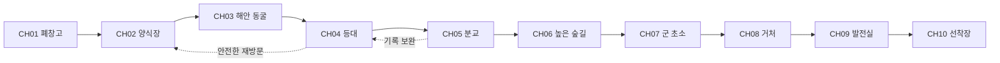

# 표류도 게임과 이야기 설계

이 문서는 개발자가 게임의 목적과 사건의 진실을 먼저 이해하기 위한 기준이다. **폐시설이 남은 섬에서 물리적 탈출과 과거 사건의 재구성을 함께 수행하는 2D 미스터리 방탈출**을 만든다. 아래 설정·인물·정답·분기는 표류도용 창작 제안이며 제작 기본안으로 채택한다. 이 문서에는 결말 스포일러가 있다.

## 제품 방향

| 항목 | 기본안 |
| --- | --- |
| 가제 | 표류도 시즌 1 기억의 썰물 |
| 장르 | 탐색형 방탈출, 미스터리, 대화 어드벤처 |
| 플랫폼 | PC 및 모바일 웹 우선, Capacitor 모바일 앱 확장, 세로 화면 |
| 조작 | 터치 조사, 방향 버튼 이동, 아이템 선택 후 사용, 두 아이템 조합 |
| 참고 분위기 | 검은방 3의 폐쇄감, 인물 사이의 불신, 과거의 죄와 사건을 추적하는 긴장감 |
| 표현 | 고해상도 고정 시점 2D 배경, 현대적인 인물 반신 일러스트, 명확한 UI, 제한적인 환경 애니메이션 |
| 목표 플레이 시간 | 1챕터 35~50분, 시즌 1 약 5~7시간이라는 제작 목표 |
| 주요 경험 | 관찰로 단서 발견 → 이해로 잠금 해제 → 새 공간 → 증언과 물증의 모순 |
| 긴장 연출 | 감시 카메라, 방송, 파도, 조명과 정전, 제한 구간의 수위 |
| 첫 버전 범위 | 1챕터 완주, 조수 시스템 테스트용 별도 장면 |

시간과 분량은 실측 수치가 아닌 설계 목표다. 퍼즐 25개를 모든 챕터에 반복 배치하지 않는다. 1챕터의 25개는 **핵심 퍼즐 12개와 조사·획득·이동 13개**이며 실제 사고를 요구하는 퍼즐 수와 진행 단계 수를 구분한다.

시각 방향은 **검은방 3의 전반적인 분위기를 바탕으로 한 현대적인 2D 미스터리 스릴러**다. 표류도의 섬·시설·인물에 맞는 독자적인 디자인을 사용한다. 고해상도 제작, 입체적인 2D 명암, 정교한 재질과 조명, 가독성 높은 UI를 아트 완료 기준으로 삼는다. 탐색·아이템 사용·조합은 이 게임의 명세에 따라 구현하고, 참고작의 특정 루트나 UI 배치를 그대로 구현하는 것을 요구하지 않는다.

## 플레이 원칙

1. 필수 정답은 플레이어가 접근 가능한 단서에서 도출된다. 제작자가 아는 설정이나 검색 지식이 필요하지 않다.
2. 주변을 터치하면 조사 결과가 나오고, 재방문하면 현재 상태에 맞는 결과가 나온다. 같은 설명을 무한히 반복하지 않는다.
3. 틀린 사용은 짧은 이유를 알려 주며 아이템을 소모하지 않는다. 필수 아이템은 버리거나 영구적으로 잃을 수 없다.
4. 이야기를 읽거나 메뉴를 보는 동안 위험 타이머는 멈춘다. 화면 밖의 현실 시간으로 진행을 강제하지 않는다.
5. 단서의 위치를 찾는 어려움과 단서의 의미를 해석하는 어려움을 따로 조정한다. 점처럼 작은 터치 영역으로 난도를 높이지 않는다.
6. 주요 사실은 물증과 증언의 조합으로 확인한다. 마지막 방송 한 번으로 앞의 추리가 모두 무효가 되는 결말을 쓰지 않는다.

## 섬과 과거 사건

가상의 **연무도**는 남해 외곽의 작은 섬이다. 폐양식장, 분교, 등대, 군 초소, 중앙 발전실, 선착장이 있다. 주요 경로는 낮은 해안길과 높은 숲길 두 축으로 연결된다. 납치범은 오래된 유선 스피커와 CCTV 일부를 복구했지만, 섬 전체를 실시간으로 통제하는 초능력 같은 감시 능력은 없다.

사건은 현재로부터 8년 전 9월 17일에 발생했다. 양식장 운영사 **해담개발**이 불법 폐수 배출을 숨기기 위해 관측 기록과 안전 보고서를 조작했다. 태풍 접근 시 저지대 대피 방송까지 지연되어 주민 6명이 사망했다. 공식 발표는 주민의 무단 진입과 자연재해를 원인으로 기록했다.

주인공 한도윤은 당시 외주 조사 업체의 신입 기록 담당자였다. 원본 수위 기록과 대피 방송 로그를 발견했지만 상사의 압박 아래 축약된 안전 보고서에 전자서명했다. 그날 밤 뒤늦게 원본을 저장 장치에 복사하고 주민 대피를 도우려 했다. 도움이 있었다는 사실은 책임을 지워 주지 않는다. 피해자 유가족은 보고서 서명과 지연된 방송만 알고 있다.

현재의 감금은 사고가 아닌 계획된 범죄다. 납치범 윤태오는 죽은 누나의 명예를 회복할 증거와 책임 인정이 필요해 사건 관계자를 섬으로 데려왔다. 도윤은 납치 과정에서 넘어져 머리를 다쳐 섬과 직전 상황의 기억이 단편화됐다. 평소 지식과 아이템 사용 능력은 유지된다. 작품 안에서는 진단명을 확정하지 않고 기억 공백의 상태만 보여 준다.

## 사건 시간표

| 시점 | 실제 사건 | 플레이어가 먼저 받는 정보 |
| --- | --- | --- |
| 8년 전 9월 15일 | 원본 관측에서 위험 수위와 폐수 흔적 확인 | CH02 관리 일지의 삭제 흔적 |
| 9월 16일 | 해담개발이 보고서 수정 요구, 도윤이 축약본에 서명 | CH05 사진 속 주인공 얼굴 |
| 9월 17일 18시 40분 | 대피 방송 요청이 접수됨 | CH04 등대의 중계 기록 |
| 19시 10분 | 운영사 지시로 방송 보류 | CH07 무전 로그와 서명 불일치 |
| 19시 35분 | 해안길 침수, 주민 고립 | CH03 벽의 대피 표식 |
| 20시 05분 | 도윤이 수동 방송과 구조에 가담 | CH08 원본 CCTV의 두 번째 구간 |
| 현재 D일 16시 30분 | 도윤이 창고에서 각성 | CH01 방송과 감금 상태 |
| D일 밤 | 폭풍 접근, 태오의 시설 통제 붕괴 | CH09 감시의 한계와 협력 가능성 |
| D+1일 새벽 | 출항 가능 조수 창 | CH10 조수표와 마지막 선택 |

게임 시간은 사건 연출용 수치이며 실제 천문 계산을 재현하지 않는다. 챕터가 넘어갈 때 필요하면 이야기 시간 점프를 표시한다. 5시간 플레이가 섬의 5시간과 동일하다고 약속하지 않는다.

## 인물

| 인물 | 표면 역할 | 사실과 개인 목표 | 말투 및 시각 특징 |
| --- | --- | --- | --- |
| 한도윤 31세 | 기억이 끊긴 기록 담당자, 플레이어 | 서명에 책임이 있다. 원본을 공개하고 생존자를 탈출시키려 한다 | 짧은 관찰문, 마른 회색 셔츠와 사용 흔적, 오른손 오래된 흉터 |
| 윤태오 34세 | 방송 속 감시자 | 연무도 출신 설비 기사. 누나 윤서희의 사망과 주민 누명에 분노 | 낮고 절제된 문장, 작업 점퍼, 후반에 피로와 흔들림 |
| 박서린 29세 | CH06에서 만나는 생존자 | 당시 분교 자원봉사자. 현재 기록을 추적한 지역 기자 | 확인 질문이 많음, 방수 재킷, 메모 수첩 |
| 강민석 46세 | 다른 감금 피해자, CH02 흔적과 CH07 대면 | 당시 운영사 관리 책임자. 방송 보류를 집행했다 | 책임을 분산하는 말투, 구겨진 와이셔츠 |
| 오혜진 39세 | CH05에서 구조하는 피해자 | 당시 보고서 검토자. 수정 지시 메일을 보관했다 | 정확한 수치와 날짜, 안경, 손목 붕대 |
| 윤서희 사건 당시 25세 | 기록과 기억 속 인물 | 태오의 누나, 분교 보조교사. 대피를 돕다가 사망 | 현재 인물과 혼동하지 않는 기록 프레임, 독자적 디자인 |

도윤의 내면 관찰은 진실과 다른 확신을 사실 문장으로 쓰지 않는다. 기억 조각은 날짜가 흐릿한 표현으로 제시하며 기록으로 검증하기 전에는 수첩에서 ‘미확인’으로 분류한다. 서린은 정답을 자동 제공하는 동료가 아니라 도윤의 해석을 반박하는 인물이다.

## 10챕터 진행 설계

| 장 | 공간과 목표 | 대표 퍼즐과 실제 해법 | 이야기 보상 | 다음 장 조건 |
| --- | --- | --- | --- | --- |
| CH01 각성 | 폐창고 4공간에서 나가기 | 선반 417, 점검함 123, 배수 밸브, UV 출구 2641 | 서명 흔적, 스피커의 기억 요구 | 외부 게이트 통과 |
| CH02 수면 아래 | 관리동과 수조 3구역, 해안길 열기 | 펌프를 정지한 뒤 우회 밸브로 목표 수위 표식 2까지 낮춤. 측정컵 대신 눈금과 배관도가 단서 | 강민석 이름이 적힌 훼손 일지 E01 | 배수 완료와 관측 시계 획득 |
| CH03 바다가 닫히기 전에 | 동굴 3장면, 중계 열쇠 회수 | 조수표의 썰물 구간에 입장. 반사판 3개를 동굴 표식에 따라 회전해 표적을 밝힘 | 주민 대피 동선과 당시 생존 시간의 모순 | 중계 열쇠 회수 후 안전구역 도착 |
| CH04 꺼진 등대 | 등대 4구역, 지도 및 기록 확보 | 단말에 표시된 모스 대응표로 3자 메시지를 해독. 렌즈는 육상 표적 기호와 정렬 | 대피 요청 접수 시각 E02, 전체 섬 지도 | 중계 장치 복구와 지도 확보 |
| CH05 마지막 출석 | 분교 4구역, 혜진 구조 | 결석 표시·학급 사진·자리표를 대조해 잠긴 교무실의 사물함 순서를 도출 | 도윤의 방문 사진, 보고서 서명 기억, 혜진 증언 | 혜진 구조와 높은 숲길 열쇠 |
| CH06 숲의 목격자 | 숲길 3구역, 서린과 합류 | 장력 표시를 읽고 안전 고정핀부터 끼운 다음 줄을 풀어 덫 해제. 판자와 끈으로 짧은 다리 보강 | 원본과 수정본이 모두 필요하다는 목표 | 동료 합류와 초소 진입 |
| CH07 응답 없는 주파수 | 초소 3구역, 로그 복구 | 현장 주파수표로 수신 대역 선택, 난수표의 날짜 행과 호출부호 열 교차. 외부 안테나 단선 때문에 구조 요청은 실패 | 방송 보류 서명 E03, 통신선이 거처로 이어짐 | 통신 로그 백업과 감시선 추적 |
| CH08 감시자의 방 | 거처 4구역, 동기와 원본 확보 | 모니터 시각 오차를 로그로 보정하고 두 CCTV 구간을 맞춤. 날짜 파일에 접근 | 태오의 신원, 도윤의 서명 책임과 뒤늦은 구조 행동, 원본 영상 E04 | 원본 백업, `acknowledged_responsibility` 선택 |
| CH09 폭풍의 밤 | 발전실과 피난실 3구역, 동료 구조 | 차단 순서·연료 공급·시동 순서를 작업 지침으로 확인. 추격은 소리 경고에 맞춰 지정 은신처 선택 | 태오의 통제 실패, 협력 또는 강행 | 발전기 복구, 혜진과 서린의 생존 확정 |
| CH10 새벽의 선착장 | 부두와 보트 3구역, 출항 | 정비 설명서로 연료선·접점 수리, 등대 신호와 조수표의 안전 출항 창 일치 | 책임 인정과 증거 공개의 선택, 3개 엔딩 | 수리 완료 후 출항 또는 대면 실패 |

CH02 이후의 세부 숫자·장면별 핫스폿·전체 대사·데이터는 각 장 개발 전에 작성해야 한다. 이 표의 대표 해법을 근거 없는 임의 비밀번호로 대체하지 않는다. CH03 시계는 CH02에서 이미 설명하고 CH01에는 미리보기 안내만 둔다.

## 섬 이동과 지도

실제 지도는 공간 위치를 보여 주고 스토리 선형도와 구분한다. 초반에는 발견한 구역만 표시하며 CH04에서 전체 지형을 공개한다. 잠긴 구역은 잠금 사유를 표시한다. 빠른 이동은 발견·안전·현재 조수 통행 가능 조건을 모두 만족할 때만 제공한다. CH01의 지도 버튼은 사용 가능하며 ‘섬 위치 미확인’과 현재 창고 내부도만 보여 준다.

## 조수와 위험

기본 조수는 **확정 행동 기반**이다. 일반 조사·대화·메뉴·실패한 입력은 시간을 진행시키지 않는다. 이동 또는 명시적인 ‘기다리기’만 1틱씩 진행한다. 주기는 LOW 4틱 → RISING 2틱 → HIGH 4틱 → FALLING 2틱이다. 1틱은 이야기상의 5분으로 표시하지만 실제 해양 조석 주기라고 설명하지 않는다.

CH03에서는 동굴에 들어가기 전에 별도의 **실시간 수위 구간**을 고지한다. 기본 180초, 여유 모드 360초, 접근성 모드는 위험 타이머 없음이다. 입장 시 LOW와 잔여 위험 틱 4 이상이 필요하며, 위험 구간에서는 일반 조수 틱을 동결하고 수위 타이머가 퇴로를 제어한다. 경고는 남은 90·45·15초에 소리·텍스트·수위 표시로 중복 제공한다. 만료 시 안전 입구로 자동 후퇴하고 입장 체크포인트로 복원한다. 아이템과 퍼즐은 입장 전 상태로 롤백한다. 읽기·메뉴·백그라운드에서 타이머는 정지한다.

현재 수위가 바뀌어도 캐릭터가 갇히는 장면은 만들지 않는다. 모든 조수 제한 공간에는 안전한 퇴로 또는 자동 후퇴가 있다. 강제 실패는 배드 엔딩이 아니라 재시도 경험이다. CH09의 추격도 같은 원칙을 적용하되 별도의 지역 체크포인트를 쓴다.

## 방송과 힌트

스토리 방송은 도착 이벤트당 한 번만 실행하고 수첩에 전문을 보관한다. 힌트 방송은 플레이어가 현재 과제를 선택한 뒤 요청한다. 1단계는 위치, 2단계는 해석, 3단계는 정확한 조작 또는 정답이다. 광고나 재화 소비는 첫 버전에 없다. 힌트 사용은 엔딩 조건을 바꾸지 않는다.

태오는 CH01에서 ‘기억해 내면 보내 줄게’라고 말한다. CH08에서 기억만으로 증거가 생기지 않는다는 사실이 드러나고, 플레이어는 원본 확보를 선택한다. 방송이 항상 진실을 말하는 것은 아니므로 방송 자체를 정답 단서로 쓸 때는 현장 표식이나 기록으로 검증할 수 있어야 한다.

## 증거와 엔딩

| 증거 ID | 내용 | 획득 조건 |
| --- | --- | --- |
| E01 | CH02 훼손 관리 일지 | 관리동 서랍 조사, 엔딩용 보완 가능 |
| E02 | CH04 대피 요청 접수 원본 | 등대 중계 복구, 엔딩용 보완 가능 |
| E03 | CH07 방송 보류 서명 로그 | 진행상 필수 |
| E04 | CH08 원본 CCTV 백업 | 진행상 필수 |

엔딩 평가는 CH10 최종 선택 직전에 한 번 실행한다. 우선순위는 B → T → N이다. `all_rescued`는 CH09 종료 시 서린과 혜진 두 인물이 모두 안전할 때 참이다.

| 엔딩 | 결정 조건 | 결과 |
| --- | --- | --- |
| B 침묵의 섬 | 최종 대면에서 `violence` 선택 | 시설 손상으로 출항 창을 놓친다. 직전 체크포인트에서 다시 선택 가능 |
| T 기억의 귀환 | `nonviolent` 선택 AND E01~E04 전부 확보 AND 책임 인정 AND 두 동료 구조 | 모두 탈출하고 원본 공개. 도윤도 조사에 응하며 책임을 인정한다 |
| N 표류 끝 | B가 아니고 T 조건을 모두 충족하지 못함 | 생존자는 탈출하나 사건의 일부가 증명되지 않는다 |

E01·E02는 CH09 진입 전 안전 재방문으로 보완 가능하다. 분기 직전에 ‘미확보 기록 2건’처럼 현재 상태를 알려 주며, 최종 선택의 구체적 결말은 노출하지 않는다. E03·E04는 필수 진행 증거이므로 놓친 채 최종 장에 진입하지 않는다. 첫 회차에도 T 엔딩을 볼 수 있다. 엔딩 갤러리에는 본 엔딩만 표시한다.

## 제작 범위와 분량

10챕터 배경 장면은 위 표 기준 34개를 초기 예산으로 잡는다. 근접 화면·상태 변화·회상 CG는 별도다. 1챕터는 P01~P10 웹 데모 → 전체 25단계 → 실제 아트 적용 → Android 앱 검증 순으로 만든다. 1챕터를 검증한 뒤 나머지 챕터를 같은 데이터 구조로 확장한다.

가격·등급·출시 일정은 확정하지 않았다. 폭력 표현은 결과와 긴장 중심으로 계획하며 유혈 클로즈업은 첫 아트 범위에 넣지 않는다. 제작 중 핵심 조작과 모바일 가독성이 검증되면 목표 시간과 분량을 재산정한다.
